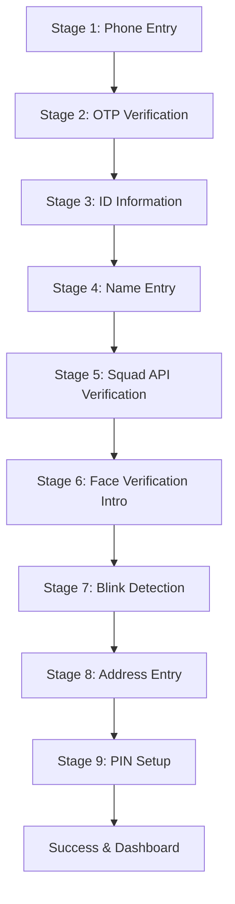
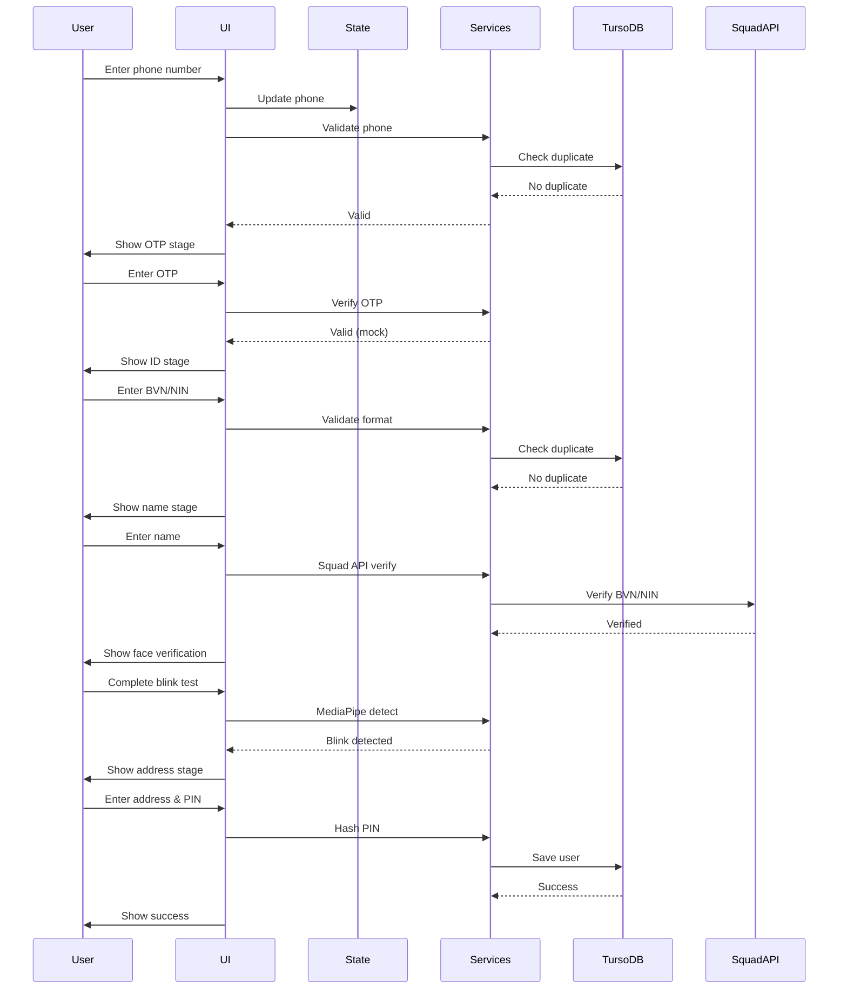
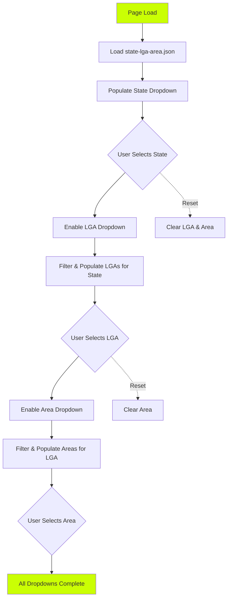

# Design Document: ScrowPay Account Creation Flow

## Overview

The ScrowPay Account Creation Flow is a comprehensive 9-stage web-based registration system that guides users through phone verification, identity verification, biometric liveness checks, and profile setup. The system creates verified user accounts capable of performing secure escrow transactions on the ScrowPay platform.

### Purpose

This design provides a complete technical specification for implementing a multi-stage account creation flow that:
- Verifies user identity through BVN/NIN validation via Squad API
- Performs liveness detection using MediaPipe blink detection
- Collects and validates user profile information
- Securely stores user data in Turso DB
- Maintains visual consistency with the existing ScrowPay design system

### Key Design Goals

1. **Simplicity**: Hackathon-friendly architecture achievable in <3 days
2. **Security**: Secure PIN hashing, data encryption, duplicate prevention
3. **User Experience**: Clear visual feedback, smooth stage transitions, consistent branding
4. **Integration**: Seamless integration with Squad API, MediaPipe, and Turso DB
5. **Pragmatism**: Mock implementations where appropriate (face matching, fixed OTP)

### Technology Stack

- **Frontend**: HTML, CSS (Tailwind CSS), Vanilla JavaScript
- **Identity Verification**: Squad API (BVN/NIN verification)
- **Liveness Detection**: MediaPipe Face Mesh (JavaScript)
- **Database**: Turso DB (libSQL)
- **Styling**: Tailwind CSS with ScrowPay brand colors

## Architecture

### System Architecture Overview

The account creation flow follows a linear, state-machine-based architecture with 9 sequential stages. Each stage is responsible for collecting specific user data, performing validation, and transitioning to the next stage upon successful completion.



### Architectural Patterns

**1. Single Page Application (SPA) with Stage-Based Rendering**

The application uses a single HTML file with JavaScript-driven stage rendering. Each stage is rendered dynamically by:
- Hiding the current stage's DOM elements
- Rendering the next stage's DOM elements
- Updating the application state

**2. State Management**

A simple JavaScript object maintains the registration state:

```javascript
const registrationState = {
  currentStage: 1,
  phoneNumber: null,
  idType: null, // 'BVN' or 'NIN'
  idNumber: null,
  firstName: null,
  middleName: null,
  lastName: null,
  currentAddress: {},
  permanentAddress: {},
  pin: null,
  verificationStatus: {}
};
```

**3. Component-Based UI Structure**

Each stage is implemented as a reusable component with:
- Render function (generates DOM)
- Validation function (validates user input)
- Submit handler (processes data and transitions)

**4. Service Layer Pattern**

External integrations are abstracted into service modules:
- `PhoneValidationService`: Phone number format validation
- `OTPService`: OTP verification (mock implementation)
- `SquadAPIService`: BVN/NIN verification
- `MediaPipeService`: Blink detection and liveness check
- `TursoDBService`: Database operations
- `PINService`: PIN validation and hashing

### Data Flow Architecture



## Components and Interfaces

### Frontend Components

#### 1. StageManager Component

**Responsibility**: Orchestrates stage transitions and manages the overall flow.

**Interface**:
```javascript
class StageManager {
  constructor(initialStage = 1)
  getCurrentStage(): number
  goToStage(stageNumber: number): void
  goToNextStage(): void
  goToPreviousStage(): void
  renderCurrentStage(): void
}
```

**Key Methods**:
- `renderCurrentStage()`: Clears the main container and renders the current stage
- `goToStage(n)`: Validates transition and updates current stage
- `goToNextStage()`: Increments stage and re-renders

#### 2. Stage Components

Each stage implements a common interface:

```javascript
interface StageComponent {
  render(): HTMLElement
  validate(): ValidationResult
  onSubmit(): Promise<void>
  onBack?(): void
}
```

**Stage 1: PhoneEntryStage**
- Renders phone input with +234 prefix
- Validates Nigerian phone format (with/without leading 0)
- Checks for duplicate phone numbers in database

**Stage 2: OTPVerificationStage**
- Renders 6-digit OTP input boxes
- Displays toast notification on load
- Validates OTP (hardcoded "123456")
- Shows success/failure modals

**Stage 3: IDInformationStage**
- Renders BVN/NIN toggle selector
- Renders 11-digit input boxes
- Validates ID format (BVN starts with 1 or 2)
- Shows confirmation modal with edit/confirm options
- Checks for duplicate IDs in database

**Stage 4: NameEntryStage**
- Renders first name, middle name, last name inputs
- Validates alphabetic characters
- Stores names in registration state

**Stage 5: SquadAPIVerificationStage**
- Displays loading indicator
- Calls Squad API with BVN/NIN
- Handles success/failure responses
- Shows retry option on failure

**Stage 6: FaceVerificationIntroStage**
- Displays face verification explanation
- Renders "Let's Start" button
- Transitions to blink detection

**Stage 7: BlinkDetectionStage**
- Requests camera access
- Initializes MediaPipe Face Mesh
- Displays live camera feed with oval overlay
- Calculates Eye Aspect Ratio (EAR)
- Detects blinks and transitions on success

**Stage 8: AddressEntryStage**
- Renders current address fields with cascading dropdowns (State → LGA → Area/Ward)
- Implements cascading behavior: LGA dropdown enabled only after state selection, Area dropdown enabled only after LGA selection
- Renders Address text field and optional Landmark field
- Renders permanent address section with "Same as Current" checkbox (checked by default)
- When checkbox unchecked, displays permanent address cascading dropdowns
- Resets dependent dropdowns when parent selection changes
- Validates required fields (State, LGA, Area, Address text)
- Stores address data in registration state

**Cascading Dropdown Flow Diagram**:



**Cascading Dropdown Implementation Details**:

The address entry stage uses a comprehensive cascading dropdown system powered by a static JSON file containing all 36 Nigerian states, 774 LGAs, and their corresponding wards/areas.

**Data Source**:
- Static file: `state-lga-area.json` (bundled with frontend)
- Contains complete Nigerian administrative divisions
- No API calls required - instant population even on poor network
- Eliminates external dependencies and points of failure

**Cascading Behavior**:

1. **State Dropdown (Current Address)**:
   - Populated on page load from `AddressDataService.getStates()`
   - Shows all 36 Nigerian states
   - Always enabled
   - On selection: Enables LGA dropdown, populates LGA options, resets LGA and Area selections

2. **LGA Dropdown (Current Address)**:
   - Initially disabled (grayed out)
   - Enabled when state is selected
   - Populated from `AddressDataService.getLGAsForState(selectedState)`
   - Shows only LGAs for the selected state
   - On selection: Enables Area dropdown, populates Area options, resets Area selection

3. **Area/Ward Dropdown (Current Address)**:
   - Initially disabled (grayed out)
   - Enabled when LGA is selected
   - Populated from `AddressDataService.getWardsForLGA(selectedState, selectedLGA)`
   - Shows only wards/areas for the selected LGA
   - Note: JSON uses "ward" terminology (equivalent to "area")

4. **Permanent Address Dropdowns**:
   - Same cascading behavior as current address
   - Hidden by default (checkbox checked)
   - Shown when "Same as Current Address" checkbox is unchecked
   - Independent state from current address dropdowns

**Reset Logic**:
- When state changes: Clear LGA and Area selections, disable Area dropdown
- When LGA changes: Clear Area selection
- When "Same as Current" is checked: Clear permanent address selections
- When "Same as Current" is unchecked: Enable permanent address dropdowns

**Implementation Approach**:
```javascript
class AddressEntryStage {
  constructor(addressDataService) {
    this.addressService = addressDataService;
    this.currentAddress = { state: null, lga: null, area: null };
    this.permanentAddress = { state: null, lga: null, area: null };
    this.sameAsCurrent = true;
  }
  
  onStateChange(addressType, selectedState) {
    // Reset dependent dropdowns
    this[addressType].lga = null;
    this[addressType].area = null;
    
    // Populate LGA dropdown
    const lgas = this.addressService.getLGAsForState(selectedState);
    this.populateLGADropdown(addressType, lgas);
    
    // Enable LGA dropdown, disable Area dropdown
    this.enableDropdown(`${addressType}-lga`);
    this.disableDropdown(`${addressType}-area`);
  }
  
  onLGAChange(addressType, selectedLGA) {
    // Reset dependent dropdown
    this[addressType].area = null;
    
    // Populate Area dropdown
    const state = this[addressType].state;
    const wards = this.addressService.getWardsForLGA(state, selectedLGA);
    this.populateAreaDropdown(addressType, wards);
    
    // Enable Area dropdown
    this.enableDropdown(`${addressType}-area`);
  }
}
```

**User Experience Benefits**:
- Instant dropdown population (no loading spinners)
- Works offline after initial page load
- Prevents invalid state/LGA/area combinations
- Clear visual feedback (disabled state for dependent dropdowns)
- Fast and responsive even on slow networks

**Stage 9: PINSetupStage**
- Renders 6-digit PIN input boxes (twice)
- Validates PIN rules (no repeats, no consecutive digits)
- Validates PIN match
- Hashes PIN before storage

#### 3. UI Component Library

**Modal Component**
```javascript
class Modal {
  constructor(title, message, buttons)
  show(): void
  hide(): void
  onButtonClick(callback): void
}
```

**Toast Component**
```javascript
class Toast {
  constructor(message, duration = 3000)
  show(): void
  hide(): void
}
```

**InputBox Component**
```javascript
class DigitInputBox {
  constructor(maxDigits, onChange)
  render(): HTMLElement
  getValue(): string
  setValue(value): void
  focus(): void
}
```

### Backend Services

#### 1. PhoneValidationService

**Purpose**: Validates Nigerian phone number format

**Interface**:
```javascript
class PhoneValidationService {
  static validateFormat(phoneNumber: string): boolean
  static normalizePhone(phoneNumber: string): string
}
```

**Implementation**:
- Accepts formats: `08135866028` or `8135866028`
- Normalizes to: `+2348135866028`
- Validates 11 digits (with 0) or 10 digits (without 0)

#### 2. AddressDataService

**Purpose**: Loads and queries Nigerian state, LGA, and ward/area data from static JSON file

**Interface**:
```javascript
class AddressDataService {
  constructor()
  async loadData(): Promise<void>
  getStates(): string[]
  getLGAsForState(state: string): string[]
  getWardsForLGA(state: string, lga: string): string[]
}
```

**Implementation**:
- Loads `state-lga-area.json` file on initialization
- Provides filtering methods for cascading dropdown population
- Data structure from JSON:
  ```json
  [
    {
      "state": "abia",
      "lgas": [
        {
          "lga": "aba-north",
          "wards": ["ariaria-market", "eziama", "industrial-area", ...]
        }
      ]
    }
  ]
  ```
- Contains all 36 Nigerian states, 774 LGAs, and their corresponding wards
- Note: JSON uses "ward" terminology (equivalent to "area")

**Data Loading Strategy**:
- Load JSON file once on page load or when address stage is first accessed
- Cache data in memory for instant filtering
- No API calls required - all data is static and bundled with frontend
- Ensures fast population even on poor network conditions

**Filtering Logic**:
- `getStates()`: Returns array of all state names from JSON
- `getLGAsForState(state)`: Filters JSON to return LGAs for specified state
- `getWardsForLGA(state, lga)`: Filters JSON to return wards for specified state and LGA

#### 3. OTPService

**Purpose**: Handles OTP verification (mock implementation)

**Interface**:
```javascript
class OTPService {
  static verifyOTP(otp: string): boolean
}
```

**Implementation**:
- Hardcoded correct OTP: `"123456"`
- Returns `true` if OTP matches, `false` otherwise

#### 4. IDValidationService

**Purpose**: Validates BVN and NIN format

**Interface**:
```javascript
class IDValidationService {
  static validateBVN(bvn: string): boolean
  static validateNIN(nin: string): boolean
}
```

**Implementation**:
- BVN: 11 digits starting with 1 or 2
- NIN: 11 digits (any starting digit)

#### 5. SquadAPIService

**Purpose**: Integrates with Squad API for BVN/NIN verification

**Interface**:
```javascript
class SquadAPIService {
  constructor(secretKey, publicKey)
  async verifyBVN(bvn: string): Promise<VerificationResult>
  async verifyNIN(nin: string): Promise<VerificationResult>
}
```

**API Integration**:
- Endpoint: Squad API verification endpoint (from [Squad documentation](https://docs.squadco.com/))
- Authentication: Bearer token using secret key
- Request payload: `{ id_number: string, id_type: 'BVN' | 'NIN' }`
- Response: `{ status: 'success' | 'failed', data: {...}, message: string }`

**Error Handling**:
- Network errors: Display retry option
- Invalid credentials: Log error and show generic message
- Verification failure: Display specific failure reason

#### 6. MediaPipeService

**Purpose**: Performs blink detection using MediaPipe Face Mesh

**Interface**:
```javascript
class MediaPipeService {
  constructor(videoElement, canvasElement)
  async initialize(): Promise<void>
  startDetection(onBlinkDetected: callback): void
  stopDetection(): void
  calculateEAR(landmarks): number
}
```

**Implementation Details**:

MediaPipe Face Mesh provides 468 facial landmarks. Eye landmarks are used to calculate Eye Aspect Ratio (EAR):

```
EAR = (||p2 - p6|| + ||p3 - p5||) / (2 * ||p1 - p4||)
```

Where p1-p6 are eye landmark points.

**Blink Detection Algorithm**:
1. Initialize MediaPipe Face Mesh
2. Process video frames in real-time
3. Extract eye landmarks (indices 33-133 for left eye, 362-263 for right eye)
4. Calculate EAR for both eyes
5. Average the EAR values
6. Detect blink when EAR drops below threshold (0.25) then rises above threshold
7. Trigger callback on blink detection

**Library Integration**:
```html
<script src="https://cdn.jsdelivr.net/npm/@mediapipe/face_mesh"></script>
<script src="https://cdn.jsdelivr.net/npm/@mediapipe/camera_utils"></script>
```

#### 7. PINService

**Purpose**: Validates and hashes user PINs

**Interface**:
```javascript
class PINService {
  static validatePIN(pin: string): ValidationResult
  static async hashPIN(pin: string): Promise<string>
  static async verifyPIN(pin: string, hash: string): Promise<boolean>
}
```

**Validation Rules**:
- Exactly 6 digits
- No repeated digits (e.g., "111111" invalid)
- No consecutive digits (e.g., "123456" invalid)

**Hashing**:
- Use Web Crypto API: `crypto.subtle.digest('SHA-256', ...)`
- Salt with user's phone number for additional security
- Store only the hash, never the plain PIN

#### 8. TursoDBService

**Purpose**: Handles all database operations

**Interface**:
```javascript
class TursoDBService {
  constructor(databaseUrl, authToken)
  async connect(): Promise<void>
  async checkPhoneDuplicate(phone: string): Promise<boolean>
  async checkIDDuplicate(idNumber: string, idType: string): Promise<boolean>
  async saveUser(userData: UserData): Promise<void>
  async getUserByPhone(phone: string): Promise<User | null>
}
```

**Connection Setup**:
```javascript
import { createClient } from '@libsql/client';

const client = createClient({
  url: process.env.TURSO_DATABASE_URL,
  authToken: process.env.TURSO_AUTH_TOKEN
});
```

## Data Models

### Database Schema

**users table**:

```sql
CREATE TABLE users (
  id INTEGER PRIMARY KEY AUTOINCREMENT,
  phone_number TEXT UNIQUE NOT NULL,
  id_type TEXT NOT NULL CHECK(id_type IN ('BVN', 'NIN')),
  id_number TEXT UNIQUE NOT NULL,
  first_name TEXT NOT NULL,
  middle_name TEXT,
  last_name TEXT NOT NULL,
  current_address_state TEXT NOT NULL,
  current_address_lga TEXT NOT NULL,
  current_address_area TEXT NOT NULL,
  current_address_text TEXT NOT NULL,
  current_address_landmark TEXT,
  permanent_address_state TEXT NOT NULL,
  permanent_address_lga TEXT NOT NULL,
  permanent_address_area TEXT NOT NULL,
  permanent_address_text TEXT NOT NULL,
  hashed_pin TEXT NOT NULL,
  created_at DATETIME DEFAULT CURRENT_TIMESTAMP,
  updated_at DATETIME DEFAULT CURRENT_TIMESTAMP
);

CREATE UNIQUE INDEX idx_phone_number ON users(phone_number);
CREATE UNIQUE INDEX idx_id_number ON users(id_number);
CREATE INDEX idx_created_at ON users(created_at);
```

### Application Data Models

**RegistrationState**:
```typescript
interface RegistrationState {
  currentStage: number;
  phoneNumber: string | null;
  idType: 'BVN' | 'NIN' | null;
  idNumber: string | null;
  firstName: string | null;
  middleName: string | null;
  lastName: string | null;
  currentAddress: Address;
  permanentAddress: Address;
  pin: string | null;
  verificationStatus: {
    phoneVerified: boolean;
    otpVerified: boolean;
    idVerified: boolean;
    faceVerified: boolean;
  };
}
```

**Address**:
```typescript
interface Address {
  state: string | null;
  lga: string | null;
  area: string | null;
  addressText: string | null;
  landmark?: string | null;
}
```

**ValidationResult**:
```typescript
interface ValidationResult {
  isValid: boolean;
  errors: string[];
}
```

**VerificationResult**:
```typescript
interface VerificationResult {
  success: boolean;
  message: string;
  data?: any;
}
```

## Error Handling

### Error Categories

**1. Validation Errors**
- Invalid phone format
- Invalid BVN/NIN format
- Invalid PIN (repeated/consecutive digits)
- Missing required fields

**Display**: Inline error messages with red borders on input fields

**2. Duplicate Data Errors**
- Phone number already registered
- BVN/NIN already registered

**Display**: Modal with error message and "Go to Login" button

**3. Network Errors**
- Squad API unreachable
- Turso DB connection failure
- MediaPipe library load failure

**Display**: Modal with error message and "Retry" button

**4. Verification Failures**
- Incorrect OTP
- Squad API verification failed
- Blink not detected

**Display**: Modal with specific failure reason and "Retry" button

**5. Camera Access Errors**
- Camera permission denied
- No camera available
- MediaPipe initialization failure

**Display**: Modal with instructions to enable camera access

### Error Handling Strategy

**Graceful Degradation**:
- If Squad API fails, allow user to continue with warning
- If MediaPipe fails to load, provide manual verification option
- If Turso DB is unreachable, queue data for later submission

**User Feedback**:
- All errors display clear, actionable messages
- Provide retry mechanisms for transient failures
- Log errors to console for debugging

**Error Recovery**:
- Preserve user input on errors (don't clear forms)
- Allow users to go back and edit previous stages
- Provide "Contact Support" option for persistent errors

### Error Messages

```javascript
const ERROR_MESSAGES = {
  PHONE_INVALID: "Please enter a valid Nigerian phone number",
  PHONE_DUPLICATE: "This phone number is already registered. Please log in.",
  OTP_INVALID: "Verification code error. Please try again.",
  ID_INVALID_FORMAT: "Please enter a valid 11-digit BVN/NIN",
  ID_DUPLICATE: "This BVN/NIN is already registered. Please log in.",
  SQUAD_API_ERROR: "Unable to verify your identity. Please check your internet connection and try again.",
  CAMERA_DENIED: "Camera access is required for face verification. Please enable camera access and try again.",
  FACE_NOT_DETECTED: "Unable to detect your face. Please ensure your face is visible in the camera frame.",
  BLINK_NOT_DETECTED: "Blink not detected. Please blink your eyes clearly.",
  PIN_INVALID_REPEATED: "PIN cannot contain repeated digits",
  PIN_INVALID_CONSECUTIVE: "PIN cannot contain consecutive digits",
  PIN_MISMATCH: "PINs do not match. Please re-enter.",
  DATABASE_ERROR: "An error occurred. Please try again later.",
  NETWORK_ERROR: "Network error. Please check your connection and try again."
};
```

## Testing Strategy

### Unit Testing

**Components to Test**:
1. PhoneValidationService
   - Test valid formats: `08135866028`, `8135866028`
   - Test invalid formats: `123`, `08135866028123`, `abc`
   - Test normalization: `8135866028` → `+2348135866028`

2. IDValidationService
   - Test valid BVN: starts with 1 or 2, 11 digits
   - Test valid NIN: 11 digits
   - Test invalid formats: 10 digits, 12 digits, non-numeric

3. PINService
   - Test valid PINs: `102938`, `384756`
   - Test invalid PINs: `111111` (repeated), `123456` (consecutive)
   - Test PIN hashing: verify hash is generated and verifiable

4. MediaPipeService
   - Test EAR calculation with mock landmarks
   - Test blink detection threshold logic
   - Test callback invocation on blink

5. TursoDBService
   - Test duplicate checking queries
   - Test user insertion
   - Test error handling for connection failures

**Testing Framework**: Jest or Vitest

**Example Test**:
```javascript
describe('PhoneValidationService', () => {
  test('validates phone with leading zero', () => {
    expect(PhoneValidationService.validateFormat('08135866028')).toBe(true);
  });
  
  test('validates phone without leading zero', () => {
    expect(PhoneValidationService.validateFormat('8135866028')).toBe(true);
  });
  
  test('rejects invalid phone', () => {
    expect(PhoneValidationService.validateFormat('123')).toBe(false);
  });
  
  test('normalizes phone correctly', () => {
    expect(PhoneValidationService.normalizePhone('8135866028')).toBe('+2348135866028');
  });
});
```

### Integration Testing

**Scenarios to Test**:
1. Complete registration flow (happy path)
2. Duplicate phone number detection
3. Duplicate BVN/NIN detection
4. Squad API verification success/failure
5. Camera access granted/denied
6. Blink detection success/failure
7. PIN validation and storage

**Testing Approach**:
- Use Playwright or Cypress for end-to-end testing
- Mock external services (Squad API, Turso DB)
- Test stage transitions and state management

**Example Integration Test**:
```javascript
test('complete registration flow', async () => {
  // Stage 1: Phone entry
  await page.fill('#phone-input', '8135866028');
  await page.click('#next-button');
  
  // Stage 2: OTP verification
  await page.fill('#otp-input', '123456');
  await page.click('#verify-button');
  await page.waitForSelector('.success-modal');
  await page.click('.modal-close');
  
  // Stage 3: ID information
  await page.click('#bvn-toggle');
  await page.fill('#id-input', '12345678901');
  await page.click('#next-button');
  await page.click('#confirm-button');
  
  // ... continue through all stages
  
  // Verify user is created in database
  const user = await db.getUserByPhone('+2348135866028');
  expect(user).toBeDefined();
  expect(user.first_name).toBe('John');
});
```

### Manual Testing Checklist

- [ ] Phone number validation (with/without leading 0)
- [ ] OTP verification (correct/incorrect codes)
- [ ] BVN/NIN toggle and validation
- [ ] ID confirmation modal (edit/confirm)
- [ ] Squad API integration (success/failure)
- [ ] Camera access request
- [ ] Blink detection (successful blink)
- [ ] Address form (current/permanent toggle)
- [ ] PIN validation (repeated/consecutive digits)
- [ ] PIN match validation
- [ ] Success screen and dashboard navigation
- [ ] Duplicate phone number detection
- [ ] Duplicate BVN/NIN detection
- [ ] Visual consistency with ScrowPay design
- [ ] Responsive design on different screen sizes
- [ ] Error messages display correctly
- [ ] Toast notifications auto-dismiss
- [ ] Modal interactions (close, retry)

## Implementation Notes

### Development Timeline (3-Day Hackathon)

**Day 1: Foundation & Core Stages**
- Set up project structure
- Implement StageManager and state management
- Implement Stages 1-4 (Phone, OTP, ID, Name)
- Implement UI components (Modal, Toast, InputBox)
- Set up Turso DB connection and schema

**Day 2: External Integrations**
- Implement Squad API integration (Stage 5)
- Implement MediaPipe blink detection (Stages 6-7)
- Implement AddressDataService to load and query state-lga-area.json
- Implement cascading dropdown logic for address stage (Stage 8)
- Implement PIN stage with validation and hashing (Stage 9)
- Implement PINService with hashing
- Test duplicate detection

**Day 3: Polish & Testing**
- Implement error handling and user feedback
- Style all stages with ScrowPay branding
- Test complete registration flow
- Fix bugs and edge cases
- Deploy and demo

### Simplification Strategies

**1. Mock Implementations**:
- OTP: Hardcoded "123456" instead of SMS integration
- Face Matching: Simulated delay instead of NIMC database comparison

**2. Static Data Approach**:
- Address Dropdowns: Use static JSON file (`state-lga-area.json`) bundled with frontend
- Contains all 36 Nigerian states, 774 LGAs, and corresponding wards/areas
- No API calls required - instant population and offline capability
- Eliminates external dependencies and reduces implementation complexity

**3. Single-File Architecture**:
- All JavaScript in one file for simplicity
- Inline styles or single CSS file
- No build process or bundler required

**3. Single-File Architecture**:
- All JavaScript in one file for simplicity
- Inline styles or single CSS file
- No build process or bundler required

**4. Minimal Dependencies**:
- Tailwind CSS via CDN
- MediaPipe via CDN
- @libsql/client for Turso DB
- No framework (React, Vue, etc.)

### Cascading Dropdown Implementation Guide

**Overview**:
The cascading dropdown system for residential address entry uses a static JSON file approach for maximum simplicity and performance.

**Step 1: Load Address Data**
```javascript
// Initialize AddressDataService on page load or when Stage 8 is first accessed
const addressService = new AddressDataService();
await addressService.loadData(); // Loads state-lga-area.json
```

**Step 2: Populate State Dropdown**
```javascript
// Get all states and populate dropdown
const states = addressService.getStates();
const stateDropdown = document.getElementById('current-state');
states.forEach(state => {
  const option = document.createElement('option');
  option.value = state;
  option.textContent = capitalizeWords(state); // Format: "Abia" instead of "abia"
  stateDropdown.appendChild(option);
});
```

**Step 3: Handle State Selection**
```javascript
stateDropdown.addEventListener('change', (e) => {
  const selectedState = e.target.value;
  
  // Reset dependent dropdowns
  lgaDropdown.innerHTML = '<option value="">Select LGA</option>';
  areaDropdown.innerHTML = '<option value="">Select Area</option>';
  areaDropdown.disabled = true;
  
  if (selectedState) {
    // Get LGAs for selected state
    const lgas = addressService.getLGAsForState(selectedState);
    
    // Populate LGA dropdown
    lgas.forEach(lga => {
      const option = document.createElement('option');
      option.value = lga;
      option.textContent = capitalizeWords(lga);
      lgaDropdown.appendChild(option);
    });
    
    // Enable LGA dropdown
    lgaDropdown.disabled = false;
  } else {
    lgaDropdown.disabled = true;
  }
});
```

**Step 4: Handle LGA Selection**
```javascript
lgaDropdown.addEventListener('change', (e) => {
  const selectedLGA = e.target.value;
  const selectedState = stateDropdown.value;
  
  // Reset area dropdown
  areaDropdown.innerHTML = '<option value="">Select Area</option>';
  
  if (selectedLGA && selectedState) {
    // Get wards/areas for selected state and LGA
    const wards = addressService.getWardsForLGA(selectedState, selectedLGA);
    
    // Populate area dropdown
    wards.forEach(ward => {
      const option = document.createElement('option');
      option.value = ward;
      option.textContent = capitalizeWords(ward);
      areaDropdown.appendChild(option);
    });
    
    // Enable area dropdown
    areaDropdown.disabled = false;
  } else {
    areaDropdown.disabled = true;
  }
});
```

**Step 5: Handle "Same as Current Address" Checkbox**
```javascript
sameAsCurrentCheckbox.addEventListener('change', (e) => {
  const permanentAddressSection = document.getElementById('permanent-address-fields');
  
  if (e.target.checked) {
    // Hide permanent address fields
    permanentAddressSection.style.display = 'none';
    
    // Clear permanent address selections
    document.getElementById('permanent-state').value = '';
    document.getElementById('permanent-lga').value = '';
    document.getElementById('permanent-area').value = '';
    document.getElementById('permanent-address-text').value = '';
  } else {
    // Show permanent address fields
    permanentAddressSection.style.display = 'block';
    
    // Initialize permanent address dropdowns (same logic as current address)
    initializePermanentAddressDropdowns();
  }
});
```

**Key Implementation Points**:
- Load JSON data once and cache in memory
- Use `disabled` attribute for dependent dropdowns until parent is selected
- Clear and reset dependent dropdowns when parent selection changes
- Apply same cascading logic to both current and permanent address sections
- Format display text (capitalize words) while keeping values in original format
- Validate that all required dropdowns have selections before allowing stage progression

**Performance Benefits**:
- No network latency - instant dropdown population
- Works offline after initial page load
- No API rate limits or costs
- Predictable and reliable behavior

### Security Considerations

**1. PIN Security**:
- Hash PINs using SHA-256 with salt
- Never store plain-text PINs
- Use secure comparison for PIN verification

**2. Data Encryption**:
- Encrypt sensitive fields (BVN, NIN) in database
- Use HTTPS for all API calls
- Secure Turso DB connection with auth token

**3. Input Validation**:
- Validate all user input on client and server
- Sanitize inputs to prevent injection attacks
- Use parameterized queries for database operations

**4. Camera Access**:
- Request camera permission explicitly
- Display clear explanation for camera usage
- Stop camera stream after blink detection

### Performance Optimization

**1. Lazy Loading**:
- Load MediaPipe library only when needed (Stage 6)
- Initialize camera only when blink detection starts

**2. Static Data Caching**:
- Load `state-lga-area.json` once on page load or first access to Stage 8
- Cache parsed JSON data in memory for instant filtering
- No repeated file reads or API calls for dropdown population

**3. Database Indexing**:
- Create indexes on phone_number and id_number for fast duplicate checking
- Use connection pooling for Turso DB

**4. Client-Side Validation**:
- Validate inputs before making API calls
- Reduce unnecessary network requests

**5. Caching**:
- Address data already cached in memory (loaded once from JSON)
- Cache MediaPipe model after first load

### Deployment

**Hosting Options**:
- Vercel (recommended for simplicity)
- Netlify
- GitHub Pages (for static hosting)

**Environment Variables**:
```
TURSO_DATABASE_URL=libsql://your-database.turso.io
TURSO_AUTH_TOKEN=your-auth-token
SQUAD_API_SECRET_KEY=your-secret-key
SQUAD_API_PUBLIC_KEY=your-public-key
```

**Build Process**:
- No build required (vanilla HTML/CSS/JS)
- Minify JavaScript for production
- Optimize images and assets

## Appendix

### Squad API Integration Details

**Authentication**:
- Use Bearer token authentication
- Include secret key in Authorization header

**Endpoints**:
- BVN Verification: `POST /api/v1/verify/bvn`
- NIN Verification: `POST /api/v1/verify/nin`

**Request Format**:
```json
{
  "id_number": "12345678901",
  "id_type": "BVN"
}
```

**Response Format**:
```json
{
  "status": "success",
  "message": "Verification successful",
  "data": {
    "first_name": "John",
    "last_name": "Doe",
    "date_of_birth": "1990-01-01",
    "phone_number": "08135866028"
  }
}
```

### Address Data JSON Structure

**File**: `state-lga-area.json` (located in frontend folder)

**Purpose**: Contains comprehensive Nigerian administrative divisions for cascading dropdown population

**Structure**:
```json
[
  {
    "state": "abia",
    "lgas": [
      {
        "lga": "aba-north",
        "wards": [
          "ariaria-market",
          "eziama",
          "industrial-area",
          "ogbor",
          "old-aba-gra",
          "osusu",
          "st-eugenes-by-okigwe-rd",
          "umuogor",
          "umuola",
          "uratta"
        ]
      },
      {
        "lga": "aba-south",
        "wards": [
          "aba-river",
          "aba-town-hall",
          "asa",
          "ekeoha",
          "enyimba",
          "eziukwu",
          "gloucester",
          "igwebuike",
          "mosque",
          "ngwa",
          "ohazu"
        ]
      }
    ]
  },
  {
    "state": "adamawa",
    "lgas": [...]
  }
]
```

**Data Coverage**:
- **36 Nigerian States**: All states in Nigeria
- **774 LGAs**: All Local Government Areas mapped to their states
- **Wards/Areas**: All wards/areas mapped to their respective LGAs

**Terminology Note**:
- JSON uses "ward" field name
- UI displays as "Area" (ward and area are equivalent terms)

**Usage in AddressDataService**:
```javascript
class AddressDataService {
  constructor() {
    this.data = null;
  }
  
  async loadData() {
    const response = await fetch('state-lga-area.json');
    this.data = await response.json();
  }
  
  getStates() {
    return this.data.map(item => item.state);
  }
  
  getLGAsForState(state) {
    const stateData = this.data.find(item => item.state === state);
    return stateData ? stateData.lgas.map(lga => lga.lga) : [];
  }
  
  getWardsForLGA(state, lga) {
    const stateData = this.data.find(item => item.state === state);
    if (!stateData) return [];
    
    const lgaData = stateData.lgas.find(item => item.lga === lga);
    return lgaData ? lgaData.wards : [];
  }
}
```

**Benefits of Static JSON Approach**:
- No external API dependencies
- Instant population (no network latency)
- Works offline after initial page load
- No API costs or rate limits
- Predictable and reliable
- Easy to update if administrative divisions change

### MediaPipe Face Mesh Landmarks

**Eye Landmark Indices**:
- Left Eye: 33, 160, 158, 133, 153, 144
- Right Eye: 362, 385, 387, 263, 373, 380

**EAR Calculation**:
```javascript
function calculateEAR(eyeLandmarks) {
  const p1 = eyeLandmarks[0]; // Outer corner
  const p2 = eyeLandmarks[1]; // Top outer
  const p3 = eyeLandmarks[2]; // Top inner
  const p4 = eyeLandmarks[3]; // Inner corner
  const p5 = eyeLandmarks[4]; // Bottom inner
  const p6 = eyeLandmarks[5]; // Bottom outer
  
  const vertical1 = distance(p2, p6);
  const vertical2 = distance(p3, p5);
  const horizontal = distance(p1, p4);
  
  return (vertical1 + vertical2) / (2.0 * horizontal);
}
```

### Turso DB Setup Commands

```bash
# Install Turso CLI
curl -sSfL https://get.tur.so/install.sh | bash

# Login to Turso
turso auth login

# Create database
turso db create scrowpay-accounts

# Get database URL
turso db show scrowpay-accounts --url

# Create auth token
turso db tokens create scrowpay-accounts

# Connect to database shell
turso db shell scrowpay-accounts
```

### Design System Reference

**Colors**:
- Dark: `#1c1c1c`
- Green/Lime: `#caff04` or `#C0FF00`
- Gray: `#f5f5f7`
- Text: `#111111`
- Subtext: `#666666`

**Typography**:
- Font Family: Inter
- Headings: 600-700 weight
- Body: 400-500 weight

**Spacing**:
- Container padding: 2rem (32px)
- Section spacing: 4rem (64px)
- Element spacing: 1rem (16px)

**Border Radius**:
- Buttons: 9999px (fully rounded)
- Cards: 1.5rem (24px)
- Inputs: 0.75rem (12px)

**Shadows**:
- Cards: `0 10px 20px rgba(0, 0, 0, 0.1)`
- Modals: `0 20px 40px rgba(0, 0, 0, 0.15)`

