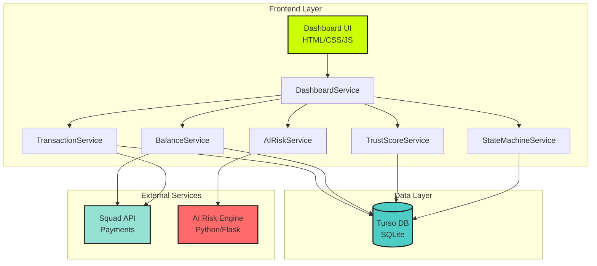
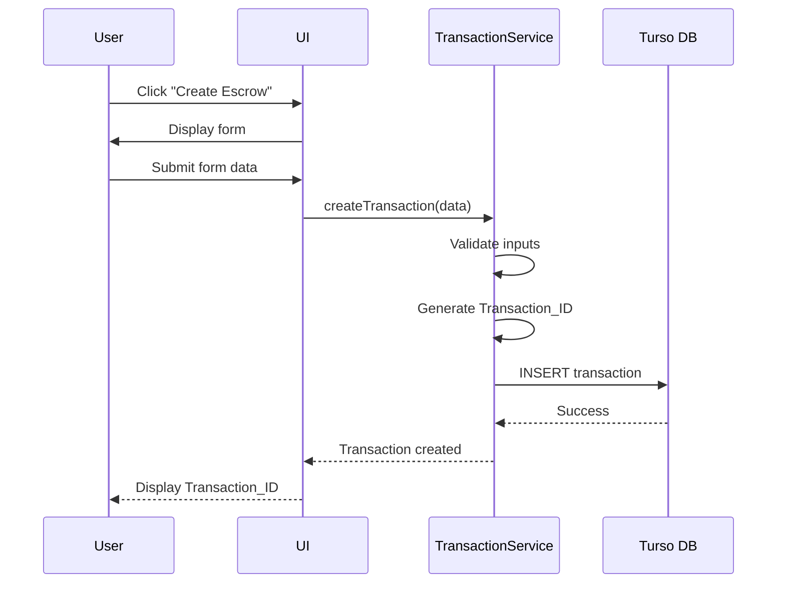
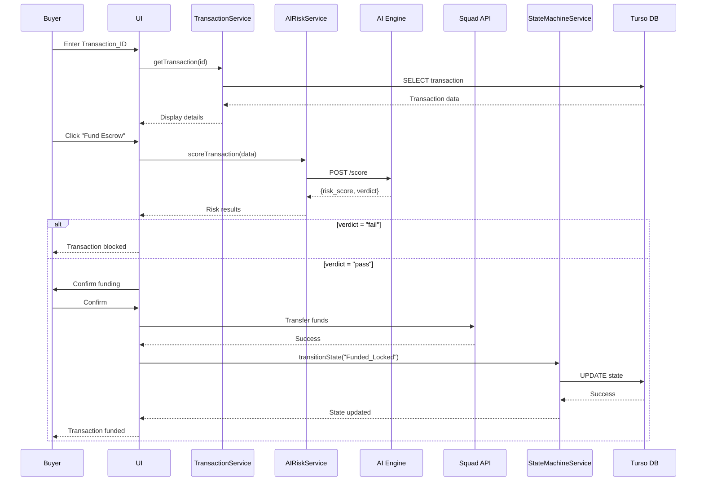
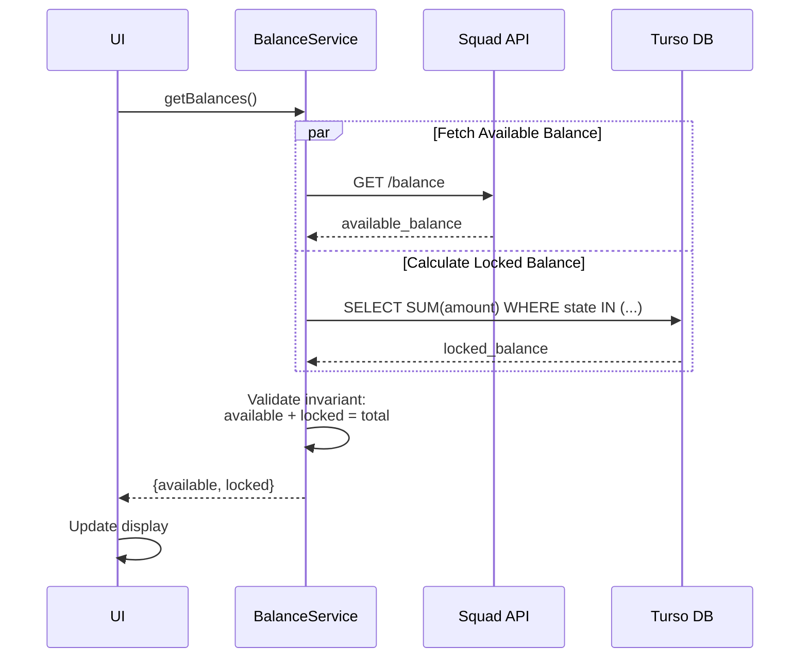
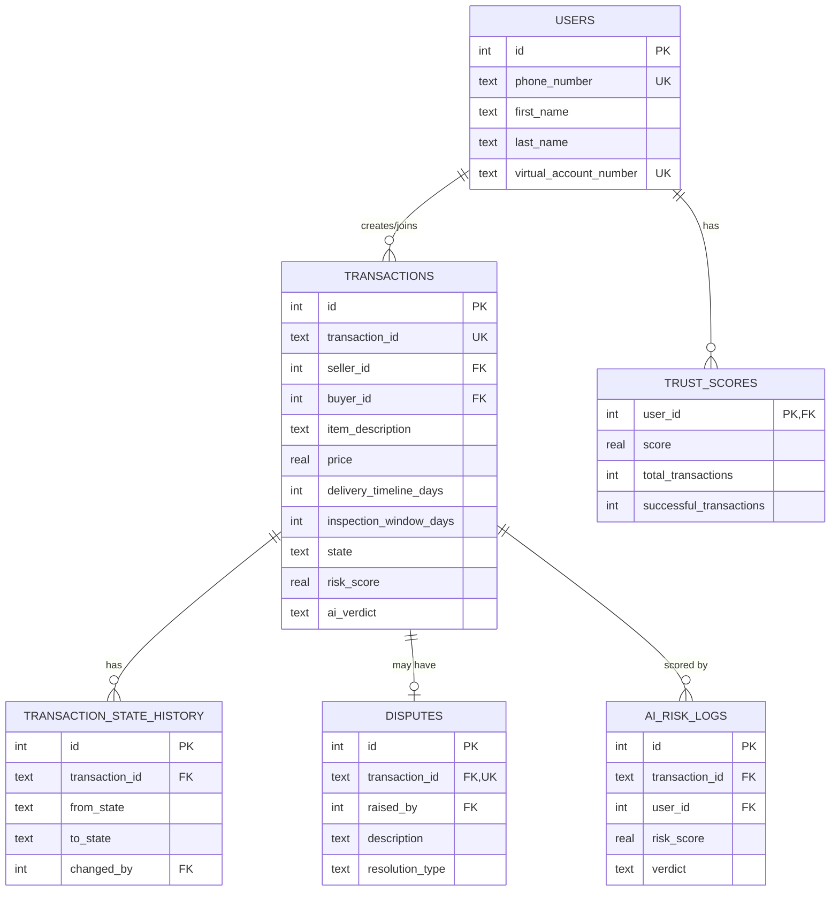
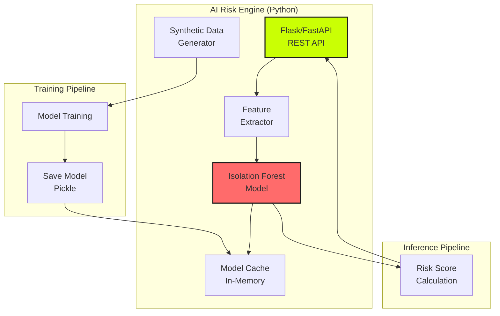
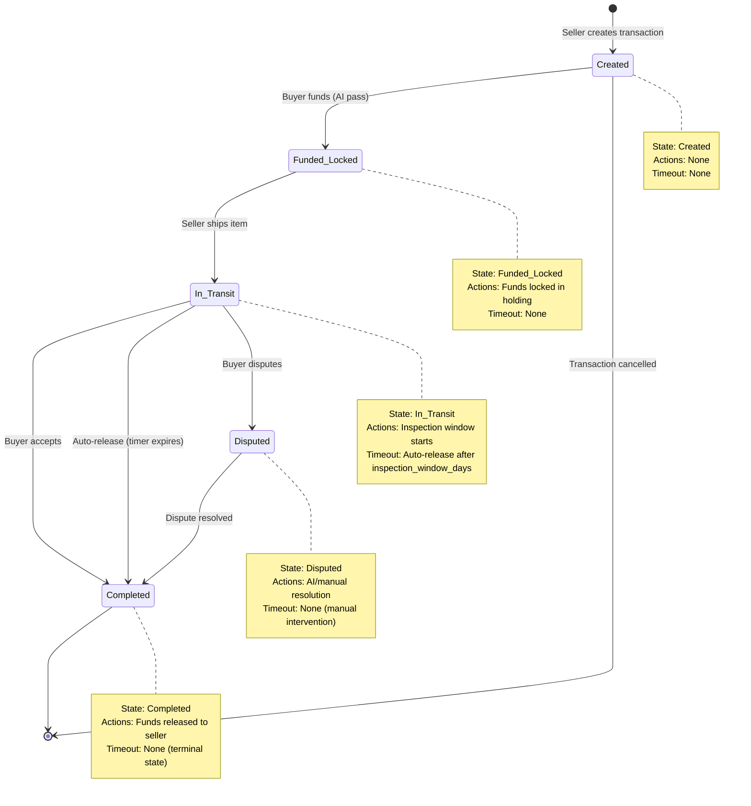

# Design Document: Escrow Dashboard

## Overview

The Escrow Dashboard is the central interface for ScrowPay, a hackathon project that implements an escrow platform with pre-transaction anomaly detection. Unlike traditional escrow services that focus on dispute resolution, ScrowPay prevents fraudulent transactions before funds are locked using an AI-powered risk scoring system based on the Isolation Forest algorithm.

### Key Differentiators

1. **Proactive Risk Detection**: AI analyzes transactions before funds are committed
2. **Real-Time Balance Management**: Separate tracking of available and locked funds
3. **Trust Score System**: Reputation metric based on transaction history
4. **Automated Resolution**: Three-tier dispute resolution (automated, AI-assisted, manual)
5. **State Machine Architecture**: Deterministic transaction lifecycle management

### Technology Stack

- **Frontend**: HTML, CSS (Tailwind), Vanilla JavaScript
- **Database**: Turso DB (libSQL over HTTP)
- **Payment API**: Squad API (virtual accounts and transfers)
- **AI Engine**: Python microservice (Flask/FastAPI + scikit-learn)
- **ML Algorithm**: Isolation Forest for anomaly detection

### Design Goals

1. **Security**: Prevent fraud before funds are locked
2. **Transparency**: Clear visibility into transaction states and balances
3. **Performance**: Sub-2-second UI updates, sub-3-second AI scoring
4. **Reliability**: Graceful degradation when external services fail
5. **Usability**: Intuitive interface for managing escrow transactions


## Architecture

### High-Level System Architecture



### Component Responsibilities

#### Frontend Services

1. **DashboardService** (Main Orchestrator)
   - Coordinates all other services
   - Manages UI state and updates
   - Handles polling for real-time updates
   - Implements optimistic UI updates

2. **TransactionService** (Transaction Management)
   - CRUD operations for transactions
   - Transaction ID generation
   - Transaction retrieval and filtering
   - State transition requests

3. **BalanceService** (Balance Calculations)
   - Available balance queries (Squad API)
   - Locked balance calculations (Turso DB)
   - Balance invariant validation
   - Cache management (30-second TTL)

4. **TrustScoreService** (Reputation Management)
   - Trust score calculation algorithm
   - Transaction history analysis
   - Recency weighting
   - Visual indicator mapping

5. **AIRiskService** (Risk Scoring Integration)
   - HTTP client for AI microservice
   - Feature extraction and formatting
   - Timeout handling (5 seconds)
   - Fallback to "fail" verdict on errors

6. **StateMachineService** (State Management)
   - Valid state transition enforcement
   - Timestamp tracking
   - Auto-release timer management
   - State history persistence

### Data Flow Diagrams

#### Transaction Creation Flow



#### Transaction Funding Flow (with AI Risk Scoring)



#### Balance Update Flow




## Components and Interfaces

### Frontend Service Classes

#### DashboardService

```javascript
class DashboardService {
  constructor(config) {
    this.transactionService = new TransactionService(config);
    this.balanceService = new BalanceService(config);
    this.trustScoreService = new TrustScoreService(config);
    this.aiRiskService = new AIRiskService(config);
    this.stateMachineService = new StateMachineService(config);
    
    this.pollingIntervals = {
      squadAPI: 30000,  // 30 seconds
      tursoDB: 10000    // 10 seconds
    };
  }
  
  async initialize(userId) {
    // Load user data
    // Start polling for updates
    // Initialize UI state
  }
  
  async refreshBalances() {
    // Fetch from BalanceService
    // Update UI
    // Validate invariant
  }
  
  async refreshTransactions() {
    // Fetch active transactions
    // Update UI lists
  }
  
  startPolling() {
    // Set up intervals for Squad API and Turso DB
  }
  
  stopPolling() {
    // Clear intervals
  }
}
```

#### TransactionService

```javascript
class TransactionService {
  constructor(config) {
    this.dbService = new TursoDBService(config.turso.url, config.turso.token);
    this.squadService = new SquadVirtualAccountService(config.squad.secretKey);
  }
  
  async createTransaction(data) {
    // Validate inputs
    // Generate unique Transaction_ID (UUID v4)
    // Save to Turso DB with state "Created"
    // Return transaction object
  }
  
  async getTransaction(transactionId) {
    // Query Turso DB
    // Return transaction with full details
  }
  
  async getActiveTransactions(userId) {
    // Query transactions where user is buyer or seller
    // Filter by active states
    // Return categorized lists
  }
  
  async getTransactionHistory(userId, filters) {
    // Query all transactions
    // Apply filters (date range, state, role)
    // Return paginated results
  }
  
  generateTransactionId() {
    // Generate UUID v4
    // Format: "TXN-" + uuid
  }
}
```

#### BalanceService

```javascript
class BalanceService {
  constructor(config) {
    this.dbService = new TursoDBService(config.turso.url, config.turso.token);
    this.squadService = new SquadVirtualAccountService(config.squad.secretKey);
    this.cache = {
      availableBalance: null,
      timestamp: null,
      ttl: 30000  // 30 seconds
    };
  }
  
  async getAvailableBalance(virtualAccountNumber) {
    // Check cache
    // If stale, fetch from Squad API
    // Update cache
    // Return balance
  }
  
  async getLockedBalance(userId) {
    // Query Turso DB for active transactions
    // SUM amounts where state IN ('Funded_Locked', 'Awaiting_Fulfillment', 'In_Transit')
    // Return locked balance
  }
  
  async getBalances(userId, virtualAccountNumber) {
    // Fetch both balances in parallel
    // Validate invariant
    // Return {available, locked, total}
  }
  
  validateBalanceInvariant(available, locked, total) {
    // Check: available + locked === total
    // Log warning if mismatch
    // Return boolean
  }
}
```

#### TrustScoreService

```javascript
class TrustScoreService {
  constructor(config) {
    this.dbService = new TursoDBService(config.turso.url, config.turso.token);
  }
  
  async calculateTrustScore(userId) {
    // Query completed transactions
    // Calculate: (successful / total) * 100
    // Apply recency weighting
    // Return score (1-100)
  }
  
  async recalculateTrustScore(userId) {
    // Trigger recalculation
    // Update UI
  }
  
  getVisualIndicator(score) {
    // Map score to color
    // < 40: red
    // 40-70: yellow
    // > 70: green
  }
  
  applyRecencyWeighting(transactions) {
    // Weight recent transactions more heavily
    // Exponential decay: weight = e^(-days/30)
  }
}
```

#### AIRiskService

```javascript
class AIRiskService {
  constructor(config) {
    this.aiEngineUrl = config.aiEngine.url;
    this.timeout = 5000;  // 5 seconds
  }
  
  async scoreTransaction(transactionData) {
    // Extract features
    // POST to AI engine
    // Handle timeout
    // Return {risk_score, verdict, anomaly_indicators}
  }
  
  extractFeatures(transactionData, userContext) {
    // Calculate transaction_velocity
    // Get device_metadata
    // Get account_age_days
    // Get counterparty_trust_score
    // Return feature object
  }
  
  async handleTimeout() {
    // Default to "fail" verdict
    // Log error
    // Return safe default
  }
}
```

#### StateMachineService

```javascript
class StateMachineService {
  constructor(config) {
    this.dbService = new TursoDBService(config.turso.url, config.turso.token);
    this.validTransitions = {
      'Created': ['Funded_Locked'],
      'Funded_Locked': ['In_Transit'],
      'In_Transit': ['Completed', 'Disputed'],
      'Disputed': ['Completed'],
      'Completed': []
    };
  }
  
  async transitionState(transactionId, newState) {
    // Get current state
    // Validate transition
    // Update state in DB
    // Record timestamp
    // Save to state history
    // Return success/failure
  }
  
  isValidTransition(currentState, newState) {
    // Check validTransitions map
    // Return boolean
  }
  
  async getStateHistory(transactionId) {
    // Query state history table
    // Return chronological list
  }
  
  async scheduleAutoRelease(transactionId, deliveryDate, inspectionWindowDays) {
    // Calculate expiry: deliveryDate + inspectionWindowDays
    // Set timer
    // On expiry, transition to "Completed"
  }
}
```

### API Interfaces

#### AI Risk Engine API

**Endpoint**: `POST /api/v1/score`

**Request**:
```json
{
  "user_id": "string",
  "transaction_amount": 50000.00,
  "transaction_velocity": 3,
  "account_age_days": 45,
  "device_fingerprint": "hash_string",
  "time_of_day": 14,
  "counterparty_trust_score": 75
}
```

**Response**:
```json
{
  "risk_score": 23.5,
  "risk_flag": false,
  "verdict": "pass",
  "anomaly_indicators": [],
  "model_version": "1.0.0",
  "timestamp": "2024-01-15T14:30:00Z"
}
```

**Error Response**:
```json
{
  "error": "Model unavailable",
  "message": "AI engine is temporarily unavailable",
  "timestamp": "2024-01-15T14:30:00Z"
}
```

#### Squad API Integration

**Fund Transfer (Buyer to Holding)**:
```javascript
{
  method: 'POST',
  endpoint: '/transfer',
  body: {
    from_account: buyer_virtual_account,
    to_account: holding_account,
    amount: transaction_amount,
    metadata: {
      transaction_id: "TXN-uuid",
      type: "escrow_funding"
    }
  }
}
```

**Fund Release (Holding to Seller)**:
```javascript
{
  method: 'POST',
  endpoint: '/transfer',
  body: {
    from_account: holding_account,
    to_account: seller_virtual_account,
    amount: transaction_amount,
    metadata: {
      transaction_id: "TXN-uuid",
      type: "escrow_release"
    }
  }
}
```

**Balance Query**:
```javascript
{
  method: 'GET',
  endpoint: '/virtual-account/{account_number}/balance'
}
```


## Data Models

### Turso DB Schema

#### Transactions Table

```sql
CREATE TABLE transactions (
  id INTEGER PRIMARY KEY AUTOINCREMENT,
  transaction_id TEXT UNIQUE NOT NULL,
  seller_id INTEGER NOT NULL,
  buyer_id INTEGER,
  item_description TEXT NOT NULL,
  price REAL NOT NULL CHECK(price >= 100 AND price <= 10000000),
  delivery_timeline_days INTEGER NOT NULL CHECK(delivery_timeline_days BETWEEN 1 AND 90),
  inspection_window_days INTEGER NOT NULL CHECK(inspection_window_days BETWEEN 1 AND 14),
  state TEXT NOT NULL CHECK(state IN ('Created', 'Funded_Locked', 'In_Transit', 'Disputed', 'Completed')),
  risk_score REAL,
  ai_verdict TEXT CHECK(ai_verdict IN ('pass', 'fail')),
  created_at DATETIME DEFAULT CURRENT_TIMESTAMP,
  updated_at DATETIME DEFAULT CURRENT_TIMESTAMP,
  funded_at DATETIME,
  shipped_at DATETIME,
  completed_at DATETIME,
  
  FOREIGN KEY (seller_id) REFERENCES users(id),
  FOREIGN KEY (buyer_id) REFERENCES users(id)
);

CREATE INDEX idx_transaction_id ON transactions(transaction_id);
CREATE INDEX idx_seller_id ON transactions(seller_id);
CREATE INDEX idx_buyer_id ON transactions(buyer_id);
CREATE INDEX idx_state ON transactions(state);
CREATE INDEX idx_created_at ON transactions(created_at);
```

**Field Descriptions**:
- `transaction_id`: Unique identifier (UUID format: "TXN-{uuid}")
- `seller_id`: User ID of the seller (creator)
- `buyer_id`: User ID of the buyer (NULL until funded)
- `item_description`: Description of goods/services
- `price`: Transaction amount in Naira (₦100 - ₦10,000,000)
- `delivery_timeline_days`: Expected delivery time (1-90 days)
- `inspection_window_days`: Buyer inspection period (1-14 days)
- `state`: Current transaction state
- `risk_score`: AI-generated risk score (1-100)
- `ai_verdict`: AI decision (pass/fail)
- `created_at`: Transaction creation timestamp
- `updated_at`: Last modification timestamp
- `funded_at`: When buyer funded the escrow
- `shipped_at`: When seller marked as shipped
- `completed_at`: When transaction completed

#### Transaction State History Table

```sql
CREATE TABLE transaction_state_history (
  id INTEGER PRIMARY KEY AUTOINCREMENT,
  transaction_id TEXT NOT NULL,
  from_state TEXT,
  to_state TEXT NOT NULL,
  changed_by INTEGER NOT NULL,
  changed_at DATETIME DEFAULT CURRENT_TIMESTAMP,
  notes TEXT,
  
  FOREIGN KEY (transaction_id) REFERENCES transactions(transaction_id),
  FOREIGN KEY (changed_by) REFERENCES users(id)
);

CREATE INDEX idx_history_transaction_id ON transaction_state_history(transaction_id);
CREATE INDEX idx_history_changed_at ON transaction_state_history(changed_at);
```

**Purpose**: Audit trail for all state transitions

#### Disputes Table

```sql
CREATE TABLE disputes (
  id INTEGER PRIMARY KEY AUTOINCREMENT,
  transaction_id TEXT NOT NULL UNIQUE,
  raised_by INTEGER NOT NULL,
  description TEXT NOT NULL,
  photo_urls TEXT,  -- JSON array of photo URLs
  ai_resolution TEXT,
  ai_confidence REAL,
  manual_resolution TEXT,
  resolved_at DATETIME,
  resolution_type TEXT CHECK(resolution_type IN ('automated', 'ai_assisted', 'manual')),
  created_at DATETIME DEFAULT CURRENT_TIMESTAMP,
  
  FOREIGN KEY (transaction_id) REFERENCES transactions(transaction_id),
  FOREIGN KEY (raised_by) REFERENCES users(id)
);

CREATE INDEX idx_dispute_transaction_id ON disputes(transaction_id);
CREATE INDEX idx_dispute_created_at ON disputes(created_at);
```

#### Trust Scores Cache Table

```sql
CREATE TABLE trust_scores (
  user_id INTEGER PRIMARY KEY,
  score REAL NOT NULL CHECK(score BETWEEN 1 AND 100),
  total_transactions INTEGER DEFAULT 0,
  successful_transactions INTEGER DEFAULT 0,
  disputed_transactions INTEGER DEFAULT 0,
  last_calculated_at DATETIME DEFAULT CURRENT_TIMESTAMP,
  
  FOREIGN KEY (user_id) REFERENCES users(id)
);

CREATE INDEX idx_trust_score ON trust_scores(score);
```

**Purpose**: Cache trust scores to avoid recalculating on every request

#### AI Risk Logs Table

```sql
CREATE TABLE ai_risk_logs (
  id INTEGER PRIMARY KEY AUTOINCREMENT,
  transaction_id TEXT NOT NULL,
  user_id INTEGER NOT NULL,
  risk_score REAL NOT NULL,
  verdict TEXT NOT NULL,
  anomaly_indicators TEXT,  -- JSON array
  features TEXT NOT NULL,  -- JSON object of input features
  model_version TEXT,
  response_time_ms INTEGER,
  created_at DATETIME DEFAULT CURRENT_TIMESTAMP,
  
  FOREIGN KEY (transaction_id) REFERENCES transactions(transaction_id),
  FOREIGN KEY (user_id) REFERENCES users(id)
);

CREATE INDEX idx_risk_log_transaction_id ON ai_risk_logs(transaction_id);
CREATE INDEX idx_risk_log_user_id ON ai_risk_logs(user_id);
CREATE INDEX idx_risk_log_created_at ON ai_risk_logs(created_at);
```

**Purpose**: Audit trail for all AI risk scoring requests

### Data Relationships



### Trust Score Calculation Logic

**Algorithm**:
```javascript
function calculateTrustScore(userId) {
  // Get completed transactions
  const transactions = getCompletedTransactions(userId);
  
  if (transactions.length === 0) {
    return 50;  // Default for new users
  }
  
  // Calculate base score
  const successfulCount = transactions.filter(t => t.state === 'Completed' && !t.disputed).length;
  const baseScore = (successfulCount / transactions.length) * 100;
  
  // Apply recency weighting
  const weightedScore = transactions.reduce((acc, txn) => {
    const daysAgo = (Date.now() - txn.completed_at) / (1000 * 60 * 60 * 24);
    const weight = Math.exp(-daysAgo / 30);  // Exponential decay over 30 days
    const txnScore = txn.disputed ? 0 : 100;
    return acc + (txnScore * weight);
  }, 0);
  
  const totalWeight = transactions.reduce((acc, txn) => {
    const daysAgo = (Date.now() - txn.completed_at) / (1000 * 60 * 60 * 24);
    return acc + Math.exp(-daysAgo / 30);
  }, 0);
  
  const finalScore = weightedScore / totalWeight;
  
  return Math.round(Math.max(1, Math.min(100, finalScore)));
}
```

**Recency Weighting**:
- Recent transactions have more impact on trust score
- Weight decays exponentially: `weight = e^(-days/30)`
- After 30 days, weight is ~37% of original
- After 90 days, weight is ~5% of original


## AI Risk Engine Design

### Architecture

The AI Risk Engine is a standalone Python microservice that uses the Isolation Forest algorithm for anomaly detection. It's designed to be lightweight, fast (<3 seconds response time), and suitable for hackathon deployment.



### Technology Stack

- **Framework**: Flask (lightweight) or FastAPI (async support)
- **ML Library**: scikit-learn (Isolation Forest)
- **Data Generation**: NumPy, Pandas
- **Model Persistence**: Pickle or Joblib
- **HTTP Client**: Requests (for testing)

### Isolation Forest Algorithm

**Why Isolation Forest?**
1. **Unsupervised**: No need for labeled fraud data
2. **Fast**: O(n log n) training, O(log n) prediction
3. **Effective**: Works well for high-dimensional data
4. **Interpretable**: Anomaly score has clear meaning

**How It Works**:
1. Randomly select a feature and split value
2. Recursively partition data until each point is isolated
3. Anomalies require fewer splits (shorter paths)
4. Anomaly score = average path length across trees

**Configuration**:
```python
from sklearn.ensemble import IsolationForest

model = IsolationForest(
    n_estimators=100,        # Number of trees
    contamination=0.05,      # Expected anomaly rate (5%)
    max_samples='auto',      # Use all samples
    random_state=42,         # Reproducibility
    n_jobs=-1                # Use all CPU cores
)
```

### Feature Engineering

**Input Features** (6 features):

1. **transaction_amount** (float)
   - Raw transaction value in Naira
   - Range: ₦100 - ₦10,000,000
   - Normalization: Log scale

2. **transaction_velocity** (int)
   - Number of transactions in last 24 hours
   - Range: 0 - 50
   - Anomaly indicator: >10 transactions/day

3. **account_age_days** (int)
   - Days since account creation
   - Range: 0 - 365+
   - Anomaly indicator: <7 days (new accounts)

4. **device_fingerprint** (hash → int)
   - Hash of device metadata (browser, OS, screen resolution)
   - Converted to integer for model input
   - Anomaly indicator: Frequent device changes

5. **time_of_day** (int)
   - Hour of transaction (0-23)
   - Anomaly indicator: Late night transactions (2-5 AM)

6. **counterparty_trust_score** (float)
   - Trust score of the other party (1-100)
   - Anomaly indicator: Low trust score (<30)

**Feature Preprocessing**:
```python
import numpy as np
from sklearn.preprocessing import StandardScaler

def preprocess_features(features):
    # Log transform transaction amount
    features['transaction_amount'] = np.log1p(features['transaction_amount'])
    
    # Normalize all features
    scaler = StandardScaler()
    normalized = scaler.fit_transform(features)
    
    return normalized
```

### Synthetic Data Generation

**Purpose**: Generate realistic training data for hackathon demo

**Dataset Specifications**:
- Total records: 5,000 - 10,000
- Anomaly rate: 5% (250-500 anomalies)
- Normal transactions: 95%
- Anomalous transactions: 5%

**Normal Transaction Distribution**:
```python
import numpy as np
import pandas as pd

def generate_normal_transactions(n=9500):
    return pd.DataFrame({
        'transaction_amount': np.random.lognormal(10, 1.5, n),  # Log-normal distribution
        'transaction_velocity': np.random.poisson(2, n),         # Poisson (avg 2/day)
        'account_age_days': np.random.gamma(30, 3, n),           # Gamma distribution
        'device_fingerprint': np.random.randint(1000, 9999, n),  # Random device IDs
        'time_of_day': np.random.choice(range(8, 22), n),        # Business hours
        'counterparty_trust_score': np.random.normal(70, 15, n)  # Normal around 70
    })
```

**Anomalous Transaction Distribution**:
```python
def generate_anomalous_transactions(n=500):
    return pd.DataFrame({
        'transaction_amount': np.random.uniform(500000, 10000000, n),  # Very high amounts
        'transaction_velocity': np.random.randint(15, 50, n),          # High velocity
        'account_age_days': np.random.randint(0, 7, n),                # New accounts
        'device_fingerprint': np.random.randint(1, 100, n),            # Suspicious devices
        'time_of_day': np.random.choice([2, 3, 4, 5], n),              # Late night
        'counterparty_trust_score': np.random.uniform(1, 30, n)        # Low trust
    })
```

**Complete Generator**:
```python
def generate_synthetic_dataset(n_normal=9500, n_anomalies=500):
    normal = generate_normal_transactions(n_normal)
    anomalies = generate_anomalous_transactions(n_anomalies)
    
    # Combine and shuffle
    dataset = pd.concat([normal, anomalies], ignore_index=True)
    dataset = dataset.sample(frac=1, random_state=42).reset_index(drop=True)
    
    # Add labels (for evaluation only, not used in training)
    labels = np.concatenate([
        np.zeros(n_normal),      # Normal = 0
        np.ones(n_anomalies)     # Anomaly = 1
    ])
    labels = labels[dataset.index]
    
    return dataset, labels
```

### Model Training Pipeline

```python
from sklearn.ensemble import IsolationForest
from sklearn.metrics import precision_score, recall_score, f1_score
import joblib

def train_model():
    # Generate synthetic data
    X_train, y_train = generate_synthetic_dataset(n_normal=9500, n_anomalies=500)
    
    # Initialize model
    model = IsolationForest(
        n_estimators=100,
        contamination=0.05,
        random_state=42,
        n_jobs=-1
    )
    
    # Train model
    print("Training Isolation Forest...")
    model.fit(X_train)
    
    # Evaluate on training set
    predictions = model.predict(X_train)
    predictions = (predictions == -1).astype(int)  # -1 = anomaly, 1 = normal
    
    precision = precision_score(y_train, predictions)
    recall = recall_score(y_train, predictions)
    f1 = f1_score(y_train, predictions)
    
    print(f"Precision: {precision:.2%}")
    print(f"Recall: {recall:.2%}")
    print(f"F1 Score: {f1:.2%}")
    
    # Save model
    joblib.dump(model, 'isolation_forest_model.pkl')
    print("Model saved to isolation_forest_model.pkl")
    
    return model

# Performance targets (from requirements):
# - Precision: ≥80%
# - Recall: ≥70%
```

### REST API Implementation

**Flask Implementation**:
```python
from flask import Flask, request, jsonify
import joblib
import numpy as np
import time

app = Flask(__name__)

# Load model at startup
model = joblib.load('isolation_forest_model.pkl')

@app.route('/api/v1/score', methods=['POST'])
def score_transaction():
    start_time = time.time()
    
    try:
        # Parse request
        data = request.get_json()
        
        # Extract features
        features = np.array([[
            data['transaction_amount'],
            data['transaction_velocity'],
            data['account_age_days'],
            data['device_fingerprint'],
            data['time_of_day'],
            data['counterparty_trust_score']
        ]])
        
        # Predict
        prediction = model.predict(features)[0]
        anomaly_score = model.score_samples(features)[0]
        
        # Convert to risk score (1-100)
        # Anomaly score ranges from ~-0.5 (normal) to ~-1.0 (anomaly)
        risk_score = min(100, max(1, int((1 + anomaly_score) * 100)))
        
        # Determine verdict
        verdict = "fail" if risk_score > 80 else "pass"
        risk_flag = risk_score > 80
        
        # Identify anomaly indicators
        anomaly_indicators = []
        if data['transaction_velocity'] > 10:
            anomaly_indicators.append("High transaction velocity")
        if data['account_age_days'] < 7:
            anomaly_indicators.append("New account")
        if data['time_of_day'] in [2, 3, 4, 5]:
            anomaly_indicators.append("Unusual transaction time")
        if data['counterparty_trust_score'] < 30:
            anomaly_indicators.append("Low counterparty trust score")
        if data['transaction_amount'] > 500000:
            anomaly_indicators.append("High transaction amount")
        
        # Calculate response time
        response_time_ms = int((time.time() - start_time) * 1000)
        
        # Return response
        return jsonify({
            'risk_score': risk_score,
            'risk_flag': risk_flag,
            'verdict': verdict,
            'anomaly_indicators': anomaly_indicators,
            'model_version': '1.0.0',
            'response_time_ms': response_time_ms,
            'timestamp': time.strftime('%Y-%m-%dT%H:%M:%SZ', time.gmtime())
        }), 200
        
    except Exception as e:
        return jsonify({
            'error': 'Scoring failed',
            'message': str(e),
            'timestamp': time.strftime('%Y-%m-%dT%H:%M:%SZ', time.gmtime())
        }), 500

@app.route('/health', methods=['GET'])
def health_check():
    return jsonify({'status': 'healthy', 'model_loaded': model is not None}), 200

if __name__ == '__main__':
    app.run(host='0.0.0.0', port=5000, debug=False)
```

### Deployment Configuration

**Docker Container** (for hackathon):
```dockerfile
FROM python:3.11-slim

WORKDIR /app

COPY requirements.txt .
RUN pip install --no-cache-dir -r requirements.txt

COPY . .

# Train model on startup (for hackathon demo)
RUN python train_model.py

EXPOSE 5000

CMD ["python", "app.py"]
```

**requirements.txt**:
```
flask==3.0.0
scikit-learn==1.3.2
numpy==1.26.2
pandas==2.1.4
joblib==1.3.2
```

### Performance Optimization

1. **Model Caching**: Load model once at startup
2. **Feature Preprocessing**: Minimal computation
3. **Async Processing**: Use FastAPI for concurrent requests
4. **Response Time Target**: <3 seconds (requirement)
5. **Timeout Handling**: Dashboard times out at 5 seconds


## State Machine Implementation

### State Diagram



### Valid State Transitions

| From State | To State | Trigger | Validation |
|------------|----------|---------|------------|
| Created | Funded_Locked | Buyer funds escrow | AI verdict = "pass", Squad API success |
| Funded_Locked | In_Transit | Seller marks shipped | Seller is transaction owner |
| In_Transit | Completed | Buyer accepts | Buyer is transaction owner |
| In_Transit | Completed | Auto-release timer | Inspection window expired |
| In_Transit | Disputed | Buyer disputes | Buyer is transaction owner, within inspection window |
| Disputed | Completed | Resolution applied | AI or manual resolution complete |

### State Transition Logic

```javascript
class StateMachineService {
  constructor(config) {
    this.dbService = new TursoDBService(config.turso.url, config.turso.token);
    this.squadService = new SquadVirtualAccountService(config.squad.secretKey);
    
    // Define valid transitions
    this.validTransitions = {
      'Created': ['Funded_Locked'],
      'Funded_Locked': ['In_Transit'],
      'In_Transit': ['Completed', 'Disputed'],
      'Disputed': ['Completed'],
      'Completed': []
    };
    
    // Auto-release timers
    this.autoReleaseTimers = new Map();
  }
  
  async transitionState(transactionId, newState, userId, metadata = {}) {
    try {
      // Get current transaction
      const transaction = await this.getTransaction(transactionId);
      
      if (!transaction) {
        throw new Error('Transaction not found');
      }
      
      const currentState = transaction.state;
      
      // Validate transition
      if (!this.isValidTransition(currentState, newState)) {
        throw new Error(`Invalid transition: ${currentState} -> ${newState}`);
      }
      
      // Validate user permissions
      this.validateUserPermission(transaction, newState, userId);
      
      // Execute state-specific actions
      await this.executeStateActions(transaction, currentState, newState, metadata);
      
      // Update transaction state
      await this.updateTransactionState(transactionId, newState);
      
      // Record state history
      await this.recordStateHistory(transactionId, currentState, newState, userId, metadata);
      
      // Schedule auto-release if transitioning to In_Transit
      if (newState === 'In_Transit') {
        this.scheduleAutoRelease(transaction);
      }
      
      // Cancel auto-release if transitioning from In_Transit
      if (currentState === 'In_Transit' && newState !== 'In_Transit') {
        this.cancelAutoRelease(transactionId);
      }
      
      return { success: true, newState };
      
    } catch (error) {
      console.error('[StateMachineService] State transition failed:', error);
      throw error;
    }
  }
  
  isValidTransition(currentState, newState) {
    const validNextStates = this.validTransitions[currentState] || [];
    return validNextStates.includes(newState);
  }
  
  validateUserPermission(transaction, newState, userId) {
    // Created -> Funded_Locked: Must be buyer
    if (newState === 'Funded_Locked' && transaction.buyer_id !== userId) {
      throw new Error('Only buyer can fund transaction');
    }
    
    // Funded_Locked -> In_Transit: Must be seller
    if (newState === 'In_Transit' && transaction.seller_id !== userId) {
      throw new Error('Only seller can mark as shipped');
    }
    
    // In_Transit -> Completed: Must be buyer
    if (newState === 'Completed' && transaction.state === 'In_Transit' && transaction.buyer_id !== userId) {
      throw new Error('Only buyer can accept delivery');
    }
    
    // In_Transit -> Disputed: Must be buyer
    if (newState === 'Disputed' && transaction.buyer_id !== userId) {
      throw new Error('Only buyer can dispute transaction');
    }
  }
  
  async executeStateActions(transaction, currentState, newState, metadata) {
    // Funded_Locked: Transfer funds from buyer to holding
    if (newState === 'Funded_Locked') {
      await this.transferToHolding(transaction, metadata.buyerAccount);
    }
    
    // Completed: Release funds from holding to seller
    if (newState === 'Completed') {
      await this.releaseToSeller(transaction);
    }
    
    // In_Transit: Set shipped timestamp
    if (newState === 'In_Transit') {
      await this.setShippedTimestamp(transaction.transaction_id);
    }
    
    // Completed: Set completed timestamp
    if (newState === 'Completed') {
      await this.setCompletedTimestamp(transaction.transaction_id);
    }
  }
  
  async transferToHolding(transaction, buyerAccount) {
    const result = await this.squadService.transfer({
      from_account: buyerAccount,
      to_account: CONFIG.holdingAccount,
      amount: transaction.price,
      metadata: {
        transaction_id: transaction.transaction_id,
        type: 'escrow_funding'
      }
    });
    
    if (!result.success) {
      throw new Error('Fund transfer failed: ' + result.message);
    }
    
    // Update funded_at timestamp
    await this.dbService.execute(
      'UPDATE transactions SET funded_at = CURRENT_TIMESTAMP WHERE transaction_id = ?',
      [transaction.transaction_id]
    );
  }
  
  async releaseToSeller(transaction) {
    // Get seller's virtual account
    const seller = await this.dbService.execute(
      'SELECT virtual_account_number FROM users WHERE id = ?',
      [transaction.seller_id]
    );
    
    const result = await this.squadService.transfer({
      from_account: CONFIG.holdingAccount,
      to_account: seller.virtual_account_number,
      amount: transaction.price,
      metadata: {
        transaction_id: transaction.transaction_id,
        type: 'escrow_release'
      }
    });
    
    if (!result.success) {
      throw new Error('Fund release failed: ' + result.message);
    }
  }
  
  scheduleAutoRelease(transaction) {
    // Calculate expiry time
    const deliveryDate = new Date(transaction.shipped_at);
    const expiryDate = new Date(deliveryDate);
    expiryDate.setDate(expiryDate.getDate() + transaction.inspection_window_days);
    
    const timeUntilExpiry = expiryDate.getTime() - Date.now();
    
    if (timeUntilExpiry > 0) {
      const timerId = setTimeout(async () => {
        console.log(`[StateMachineService] Auto-releasing transaction ${transaction.transaction_id}`);
        
        try {
          await this.transitionState(
            transaction.transaction_id,
            'Completed',
            transaction.seller_id,  // System action on behalf of seller
            { autoRelease: true }
          );
          
          // Notify both parties
          await this.notifyAutoRelease(transaction);
          
        } catch (error) {
          console.error('[StateMachineService] Auto-release failed:', error);
          // Log for manual intervention
          await this.logAutoReleaseFailure(transaction.transaction_id, error);
        }
      }, timeUntilExpiry);
      
      this.autoReleaseTimers.set(transaction.transaction_id, timerId);
      
      console.log(`[StateMachineService] Auto-release scheduled for ${transaction.transaction_id} at ${expiryDate}`);
    }
  }
  
  cancelAutoRelease(transactionId) {
    const timerId = this.autoReleaseTimers.get(transactionId);
    if (timerId) {
      clearTimeout(timerId);
      this.autoReleaseTimers.delete(transactionId);
      console.log(`[StateMachineService] Auto-release cancelled for ${transactionId}`);
    }
  }
  
  async recordStateHistory(transactionId, fromState, toState, changedBy, metadata) {
    await this.dbService.execute(
      `INSERT INTO transaction_state_history 
       (transaction_id, from_state, to_state, changed_by, notes) 
       VALUES (?, ?, ?, ?, ?)`,
      [
        transactionId,
        fromState,
        toState,
        changedBy,
        JSON.stringify(metadata)
      ]
    );
  }
  
  async getStateHistory(transactionId) {
    const result = await this.dbService.execute(
      `SELECT * FROM transaction_state_history 
       WHERE transaction_id = ? 
       ORDER BY changed_at ASC`,
      [transactionId]
    );
    
    return result.rows;
  }
}
```

### Auto-Release Timer Implementation

**Requirements**:
- Inspection window: 1-14 days (configurable per transaction)
- Timer starts when state transitions to "In_Transit"
- Timer expires: `delivery_date + inspection_window_days`
- On expiry: Automatically transition to "Completed"
- Notify both buyer and seller

**Edge Cases**:
1. **Server Restart**: Timers lost
   - Solution: On startup, query all "In_Transit" transactions and reschedule timers
   
2. **Timer Drift**: JavaScript timers not precise for long durations
   - Solution: Use cron job or scheduled task to check expiry every hour
   
3. **Concurrent Actions**: Buyer accepts while timer fires
   - Solution: Use database transaction locks to prevent race conditions

**Production Implementation** (for post-hackathon):
```javascript
// Use a job queue (e.g., Bull, Agenda) instead of setTimeout
const Queue = require('bull');
const autoReleaseQueue = new Queue('auto-release');

autoReleaseQueue.process(async (job) => {
  const { transactionId } = job.data;
  await stateMachineService.transitionState(transactionId, 'Completed', null, { autoRelease: true });
});

// Schedule job
function scheduleAutoRelease(transaction) {
  const expiryDate = calculateExpiryDate(transaction);
  autoReleaseQueue.add(
    { transactionId: transaction.transaction_id },
    { delay: expiryDate.getTime() - Date.now() }
  );
}
```


## Error Handling

### Error Categories

1. **Network Errors**: Connection failures, timeouts
2. **API Errors**: Squad API failures, AI engine unavailable
3. **Validation Errors**: Invalid inputs, business rule violations
4. **State Errors**: Invalid state transitions
5. **Data Errors**: Database query failures, data corruption

### Error Handling Strategy

#### Network Errors

**Symptoms**:
- `fetch()` throws `TypeError`
- Request timeout
- DNS resolution failure

**Handling**:
```javascript
async function handleNetworkError(error, operation) {
  console.error(`[NetworkError] ${operation}:`, error);
  
  // User-friendly message
  const message = 'Unable to connect. Please check your internet connection and try again.';
  
  // Display error to user
  showErrorNotification(message);
  
  // Log for debugging
  logError({
    type: 'network',
    operation,
    error: error.message,
    timestamp: new Date().toISOString()
  });
  
  // Return safe default
  return { success: false, error: 'network_error', message };
}
```

#### Squad API Errors

**Error Codes**:
- `401/403`: Authentication failure
- `400`: Invalid request
- `500+`: Server error
- `timeout`: Request timeout

**Handling**:
```javascript
async function handleSquadAPIError(response, operation) {
  const status = response.status;
  const data = await response.json();
  
  let userMessage;
  let errorType;
  
  if (status >= 500) {
    userMessage = 'Payment service is temporarily unavailable. Please try again later.';
    errorType = 'server_error';
  } else if (status === 401 || status === 403) {
    userMessage = 'Authentication failed. Please contact support.';
    errorType = 'auth_error';
  } else if (status === 400) {
    userMessage = data.message || 'Invalid request. Please check your details.';
    errorType = 'validation_error';
  } else {
    userMessage = 'Payment processing failed. Please try again.';
    errorType = 'unknown_error';
  }
  
  // Log error
  logError({
    type: 'squad_api',
    operation,
    status,
    message: data.message,
    timestamp: new Date().toISOString()
  });
  
  // Retry logic for server errors
  if (status >= 500 && operation.retryCount < 3) {
    const delay = Math.pow(2, operation.retryCount) * 1000;  // Exponential backoff
    await sleep(delay);
    return retryOperation(operation);
  }
  
  return { success: false, error: errorType, message: userMessage };
}
```

**Retry Logic with Exponential Backoff**:
```javascript
async function retryWithBackoff(operation, maxRetries = 3) {
  for (let attempt = 0; attempt < maxRetries; attempt++) {
    try {
      return await operation();
    } catch (error) {
      if (attempt === maxRetries - 1) {
        throw error;  // Last attempt failed
      }
      
      const delay = Math.pow(2, attempt) * 1000;  // 1s, 2s, 4s
      console.log(`[Retry] Attempt ${attempt + 1} failed, retrying in ${delay}ms...`);
      await sleep(delay);
    }
  }
}

// Usage
const result = await retryWithBackoff(async () => {
  return await squadService.transfer(transferData);
});
```

#### AI Risk Engine Errors

**Error Scenarios**:
- Engine unreachable (network error)
- Request timeout (>5 seconds)
- Invalid response format
- Model error (500)

**Handling**:
```javascript
async function scoreTransactionWithFallback(transactionData) {
  try {
    // Set timeout
    const controller = new AbortController();
    const timeoutId = setTimeout(() => controller.abort(), 5000);
    
    const response = await fetch(`${AI_ENGINE_URL}/api/v1/score`, {
      method: 'POST',
      headers: { 'Content-Type': 'application/json' },
      body: JSON.stringify(transactionData),
      signal: controller.signal
    });
    
    clearTimeout(timeoutId);
    
    if (!response.ok) {
      throw new Error(`AI engine error: ${response.status}`);
    }
    
    const result = await response.json();
    return result;
    
  } catch (error) {
    console.error('[AIRiskService] Scoring failed:', error);
    
    // Fallback to "fail" verdict (safe default)
    return {
      risk_score: 100,
      risk_flag: true,
      verdict: 'fail',
      anomaly_indicators: ['AI engine unavailable'],
      fallback: true
    };
  }
}
```

**User Communication**:
```javascript
if (riskResult.fallback) {
  showWarningNotification(
    'Risk scoring unavailable. Transaction blocked for security. Please try again later or contact support.'
  );
}
```

#### Validation Errors

**Client-Side Validation**:
```javascript
function validateTransactionForm(formData) {
  const errors = [];
  
  // Price validation
  if (formData.price < 100 || formData.price > 10000000) {
    errors.push('Price must be between ₦100 and ₦10,000,000');
  }
  
  // Delivery timeline validation
  if (formData.deliveryTimeline < 1 || formData.deliveryTimeline > 90) {
    errors.push('Delivery timeline must be between 1 and 90 days');
  }
  
  // Inspection window validation
  if (formData.inspectionWindow < 1 || formData.inspectionWindow > 14) {
    errors.push('Inspection window must be between 1 and 14 days');
  }
  
  // Item description validation
  if (!formData.itemDescription || formData.itemDescription.trim().length < 10) {
    errors.push('Item description must be at least 10 characters');
  }
  
  return errors;
}

// Display errors
function displayValidationErrors(errors) {
  const errorContainer = document.getElementById('error-container');
  errorContainer.innerHTML = errors.map(err => 
    `<div class="error-message">${err}</div>`
  ).join('');
}
```

#### State Machine Errors

**Invalid Transition Handling**:
```javascript
async function handleInvalidTransition(currentState, newState, transactionId) {
  const message = `Cannot transition from ${currentState} to ${newState}`;
  
  console.error('[StateMachine] Invalid transition:', message);
  
  // Log to database
  await logError({
    type: 'state_machine',
    transaction_id: transactionId,
    current_state: currentState,
    attempted_state: newState,
    timestamp: new Date().toISOString()
  });
  
  // User-friendly message
  showErrorNotification(
    'This action is not available for the current transaction state. Please refresh the page.'
  );
  
  // Refresh transaction state
  await refreshTransactionState(transactionId);
}
```

#### Database Errors

**Connection Failure**:
```javascript
async function handleDatabaseError(error, operation) {
  console.error('[Database] Error:', error);
  
  // Check if table doesn't exist (first-time setup)
  if (error.message.includes('no such table')) {
    console.log('[Database] Creating schema...');
    await dbService.createSchema();
    return retryOperation(operation);
  }
  
  // Generic database error
  showErrorNotification(
    'Unable to load data. Please refresh the page. If the problem persists, contact support.'
  );
  
  logError({
    type: 'database',
    operation,
    error: error.message,
    timestamp: new Date().toISOString()
  });
}
```

### Error Notification UI

**Toast Notifications**:
```javascript
function showErrorNotification(message, duration = 0) {
  const toast = document.createElement('div');
  toast.className = 'toast toast-error';
  toast.innerHTML = `
    <div class="toast-content">
      <span class="toast-icon">⚠️</span>
      <span class="toast-message">${message}</span>
      <button class="toast-close" onclick="this.parentElement.parentElement.remove()">×</button>
    </div>
  `;
  
  document.body.appendChild(toast);
  
  // Auto-dismiss for non-critical errors
  if (duration > 0) {
    setTimeout(() => toast.remove(), duration);
  }
}

function showSuccessNotification(message, duration = 5000) {
  const toast = document.createElement('div');
  toast.className = 'toast toast-success';
  toast.innerHTML = `
    <div class="toast-content">
      <span class="toast-icon">✓</span>
      <span class="toast-message">${message}</span>
    </div>
  `;
  
  document.body.appendChild(toast);
  
  setTimeout(() => toast.remove(), duration);
}

function showWarningNotification(message, duration = 0) {
  const toast = document.createElement('div');
  toast.className = 'toast toast-warning';
  toast.innerHTML = `
    <div class="toast-content">
      <span class="toast-icon">⚠️</span>
      <span class="toast-message">${message}</span>
      <button class="toast-close" onclick="this.parentElement.parentElement.remove()">×</button>
    </div>
  `;
  
  document.body.appendChild(toast);
  
  if (duration > 0) {
    setTimeout(() => toast.remove(), duration);
  }
}
```

**CSS Styles**:
```css
.toast {
  position: fixed;
  top: 20px;
  right: 20px;
  min-width: 300px;
  max-width: 500px;
  padding: 16px;
  border-radius: 8px;
  box-shadow: 0 4px 12px rgba(0, 0, 0, 0.15);
  z-index: 9999;
  animation: slideIn 0.3s ease-out;
}

.toast-error {
  background: #ff6b6b;
  color: white;
}

.toast-success {
  background: #caff04;
  color: #1c1c1c;
}

.toast-warning {
  background: #ffd93d;
  color: #1c1c1c;
}

.toast-content {
  display: flex;
  align-items: center;
  gap: 12px;
}

.toast-icon {
  font-size: 24px;
}

.toast-message {
  flex: 1;
  font-size: 14px;
}

.toast-close {
  background: none;
  border: none;
  font-size: 24px;
  cursor: pointer;
  padding: 0;
  color: inherit;
}

@keyframes slideIn {
  from {
    transform: translateX(400px);
    opacity: 0;
  }
  to {
    transform: translateX(0);
    opacity: 1;
  }
}
```

### Error Logging

**Client-Side Logging**:
```javascript
class ErrorLogger {
  constructor() {
    this.logs = [];
    this.maxLogs = 100;
  }
  
  log(error) {
    const logEntry = {
      ...error,
      userAgent: navigator.userAgent,
      url: window.location.href,
      timestamp: new Date().toISOString()
    };
    
    this.logs.push(logEntry);
    
    // Keep only last 100 logs
    if (this.logs.length > this.maxLogs) {
      this.logs.shift();
    }
    
    // Send to server (optional)
    this.sendToServer(logEntry);
  }
  
  async sendToServer(logEntry) {
    try {
      await fetch('/api/logs/error', {
        method: 'POST',
        headers: { 'Content-Type': 'application/json' },
        body: JSON.stringify(logEntry)
      });
    } catch (error) {
      console.error('[ErrorLogger] Failed to send log:', error);
    }
  }
  
  getLogs() {
    return this.logs;
  }
  
  clearLogs() {
    this.logs = [];
  }
}

const errorLogger = new ErrorLogger();
```


## Correctness Properties

*A property is a characteristic or behavior that should hold true across all valid executions of a system—essentially, a formal statement about what the system should do. Properties serve as the bridge between human-readable specifications and machine-verifiable correctness guarantees.*

### Property Reflection

After analyzing all acceptance criteria, the following properties were identified as testable through property-based testing. Redundant properties have been consolidated:

**Consolidated Properties**:
- Properties 1.7 and 11.7 both test the balance invariant → Combined into Property 1
- Properties 4.6 and 5.1 both test AI-before-Squad ordering → Combined into Property 6
- Properties 6.3, 6.4, 6.5, 6.7 all test state transitions → Combined into Property 10
- Properties 3.6, 3.7, 3.8 all test input validation → Combined into Property 4

### Property 1: Balance Invariant

*For any* sequence of transaction state changes, the sum of Available_Balance and Locked_Balance SHALL always equal the total funds in the user's Virtual_Account.

**Validates: Requirements 1.7, 11.7**

**Test Strategy**: Generate random sequences of transactions with various state transitions. After each state change, query Squad API for total balance and verify that `available + locked = total`.

### Property 2: Locked Balance Calculation

*For any* user with active transactions, the Locked_Balance SHALL equal the sum of transaction amounts where the transaction state is "Funded_Locked", "Awaiting_Fulfillment", or "In_Transit" and the user is either buyer or seller.

**Validates: Requirements 1.2**

**Test Strategy**: Generate random transaction portfolios with various states and amounts. Calculate expected locked balance and compare with system calculation.

### Property 3: Currency Formatting

*For any* balance value, the formatted display SHALL include the ₦ symbol and exactly two decimal places.

**Validates: Requirements 1.5**

**Test Strategy**: Generate random balance values (including edge cases like 0, 0.1, 1000000.999). Verify formatted output matches pattern `₦\d+\.\d{2}`.

### Property 4: Input Validation Boundaries

*For any* transaction creation input, validation SHALL reject prices outside ₦100-₦10,000,000, delivery timelines outside 1-90 days, and inspection windows outside 1-14 days.

**Validates: Requirements 3.6, 3.7, 3.8, 3.9**

**Test Strategy**: Generate inputs with values inside and outside each boundary. Verify that invalid inputs are rejected and no database records are created.

### Property 5: Transaction ID Uniqueness

*For any* set of generated Transaction_IDs, each SHALL be unique across all transactions in the system.

**Validates: Requirements 3.3**

**Test Strategy**: Generate large number of transactions (1000-10000) including concurrent creations. Verify `COUNT(DISTINCT transaction_id) = COUNT(transaction_id)` in database.

### Property 6: AI Risk Scoring Before Funding

*For any* transaction funding attempt, the AI_Risk_Engine SHALL be invoked and return a verdict before Squad_API is called for fund transfer.

**Validates: Requirements 4.6, 5.1**

**Test Strategy**: Monitor call sequence during funding operations. Verify AI endpoint is called before Squad API endpoint in all cases.

### Property 7: AI Risk Engine Response Format

*For any* transaction submitted to the AI_Risk_Engine, the response SHALL contain risk_score (1-100), risk_flag (boolean), and verdict ("pass" or "fail").

**Validates: Requirements 5.3**

**Test Strategy**: Generate various transaction feature sets. Verify all responses contain required fields with correct types and value ranges.

### Property 8: Risk Verdict Enforcement

*For any* transaction where AI_Risk_Engine returns verdict="fail", the transaction SHALL NOT proceed to funding and SHALL display a block message.

**Validates: Requirements 5.4**

**Test Strategy**: Generate transactions that produce "fail" verdicts. Verify none result in Squad API calls or state transitions to "Funded_Locked".

### Property 9: Risk Score Logging

*For any* AI risk scoring request, a corresponding log entry SHALL be created in the ai_risk_logs table with all request features and response data.

**Validates: Requirements 5.8**

**Test Strategy**: Make AI scoring requests with various inputs. Verify each request has a matching log entry with complete data.

### Property 10: State Machine Transition Validity

*For any* attempted state transition, the system SHALL only allow valid transitions (Created→Funded_Locked, Funded_Locked→In_Transit, In_Transit→Completed, In_Transit→Disputed, Disputed→Completed) and SHALL reject all invalid transitions.

**Validates: Requirements 6.3, 6.4, 6.5, 6.7, 6.9**

**Test Strategy**: Attempt all possible state pairs (6×6=36 combinations). Verify only the 5 valid transitions succeed and all others are rejected with state unchanged.

### Property 11: State History Persistence

*For any* state transition that occurs, a corresponding entry SHALL be created in the transaction_state_history table with from_state, to_state, changed_by, and timestamp.

**Validates: Requirements 6.8**

**Test Strategy**: Perform various state transitions. Verify each transition has a matching history entry with all required fields populated.

### Property 12: Initial Transaction State

*For any* newly created transaction, the initial state SHALL be "Created".

**Validates: Requirements 6.2**

**Test Strategy**: Create transactions with various input parameters. Verify all start with state="Created" in database.

### Property 13: Squad API Payment Metadata

*For any* payment made through Squad_API, the payment metadata SHALL include the transaction_id.

**Validates: Requirements 7.2**

**Test Strategy**: Perform funding and release operations. Verify all Squad API calls include transaction_id in metadata field.

### Property 14: Payment Error State Preservation

*For any* Squad_API error during payment, the transaction state SHALL remain unchanged from its pre-payment state.

**Validates: Requirements 7.5**

**Test Strategy**: Mock Squad API errors at various points. Verify transaction state is not modified when errors occur.

### Property 15: Squad API Retry Logic

*For any* failed Squad_API call, the system SHALL retry up to 3 times with exponential backoff before reporting failure.

**Validates: Requirements 7.6**

**Test Strategy**: Mock transient Squad API failures. Verify retry attempts occur with correct timing (1s, 2s, 4s delays).

### Property 16: Squad API Audit Logging

*For any* Squad_API request, a corresponding log entry SHALL be created with request parameters and response data.

**Validates: Requirements 7.7**

**Test Strategy**: Make various Squad API calls. Verify each has a matching audit log entry.

### Property 17: Transaction Ownership Filtering

*For any* user, the active transactions list SHALL only include transactions where the user is either the buyer or the seller.

**Validates: Requirements 8.1**

**Test Strategy**: Create transactions for multiple users. Verify each user's query returns only their own transactions.

### Property 18: Transaction Sorting

*For any* list of transactions within a category, the transactions SHALL be sorted by creation date in descending order (newest first).

**Validates: Requirements 8.5**

**Test Strategy**: Create transactions with various creation timestamps. Verify sort order matches descending date order.

### Property 19: Inspection Window Calculation

*For any* transaction in "In_Transit" state, the inspection window expiry SHALL be calculated as delivery_date + inspection_window_days.

**Validates: Requirements 9.7**

**Test Strategy**: Generate transactions with various delivery dates and inspection windows. Verify expiry calculation is correct.

### Property 20: Auto-Release Timing

*For any* transaction in "In_Transit" state, when the inspection window expires without buyer action, the state SHALL automatically transition to "Completed".

**Validates: Requirements 6.6, 9.5**

**Test Strategy**: Create In_Transit transactions with short inspection windows. Simulate time passage and verify auto-release occurs at correct time (within 1-second tolerance).

### Property 21: Dispute Resolution Confidence Threshold

*For any* dispute where AI_Risk_Engine returns confidence >90%, the resolution SHALL be applied automatically. For confidence ≤90%, the dispute SHALL be flagged for manual review.

**Validates: Requirements 10.4, 10.5**

**Test Strategy**: Generate disputes with various AI confidence levels. Verify automatic resolution for >90% and manual review flag for ≤90%.

### Property 22: Trust Score Calculation

*For any* user transaction history, the trust score SHALL be calculated as (successful_transactions / total_transactions) × 100, weighted by transaction recency using exponential decay (weight = e^(-days/30)).

**Validates: Requirements 2.1, 2.7**

**Test Strategy**: Generate transaction histories with various success rates and dates. Verify calculated score matches formula.

### Property 23: Trust Score Bounds

*For any* calculated trust score, the value SHALL be between 1 and 100 (inclusive).

**Validates: Requirements 2.2**

**Test Strategy**: Generate extreme transaction histories (all failures, all successes, very old transactions). Verify score is always clamped to 1-100 range.

### Property 24: Trust Score Visual Indicator Mapping

*For any* trust score value, the visual indicator SHALL be red for scores <40, yellow for scores 40-70, and green for scores >70.

**Validates: Requirements 2.6**

**Test Strategy**: Generate scores across all ranges (0-39, 40-70, 71-100). Verify color mapping is correct for each range.

### Property 25: New User Default Trust Score

*For any* user with zero completed transactions, the trust score SHALL be 50.

**Validates: Requirements 2.5**

**Test Strategy**: Calculate trust score for users with no transaction history. Verify score = 50.

### Property 26: XSS Sanitization

*For any* user-generated content displayed in the UI, dangerous HTML/JavaScript SHALL be escaped to prevent XSS attacks.

**Validates: Requirements 19.4**

**Test Strategy**: Submit inputs containing XSS payloads (`<script>`, `onerror=`, etc.). Verify displayed content has dangerous characters escaped.

### Property 27: Sensitive Data Storage Prevention

*For any* operation that uses localStorage, sensitive data (PINs, full BVN, passwords) SHALL NOT be stored.

**Validates: Requirements 19.2**

**Test Strategy**: Perform all user operations. Inspect localStorage after each operation and verify no sensitive fields are present.

### Property 28: Client-Side Validation Before Submission

*For any* form submission, client-side validation SHALL occur and prevent network requests if validation fails.

**Validates: Requirements 19.3**

**Test Strategy**: Submit forms with invalid data. Verify validation errors are shown and no network requests are made.

### Property 29: Transaction Creation Rate Limiting

*For any* user, transaction creation SHALL be limited to 10 transactions per hour.

**Validates: Requirements 19.6**

**Test Strategy**: Attempt to create >10 transactions within a 1-hour window. Verify 11th and subsequent attempts are rejected.

### Property 30: Security Event Logging

*For any* security-relevant event (failed risk check, blocked transaction, rate limit exceeded), a log entry SHALL be created in the database.

**Validates: Requirements 19.7**

**Test Strategy**: Trigger various security events. Verify each has a corresponding log entry with event type and details.


## Testing Strategy

### Overview

The testing strategy for the Escrow Dashboard employs a dual approach combining property-based testing for universal correctness properties and example-based testing for specific scenarios, edge cases, and integration points.

### Property-Based Testing

**Framework**: fast-check (JavaScript property-based testing library)

**Configuration**:
- Minimum 100 iterations per property test
- Each test tagged with feature name and property number
- Tag format: `Feature: escrow-dashboard, Property {N}: {property_text}`

**Example Property Test**:
```javascript
const fc = require('fast-check');

describe('Feature: escrow-dashboard, Property 1: Balance Invariant', () => {
  it('should maintain balance invariant after all state changes', async () => {
    await fc.assert(
      fc.asyncProperty(
        fc.array(transactionArbitrary(), { minLength: 1, maxLength: 50 }),
        async (transactions) => {
          // Setup: Create transactions in database
          for (const txn of transactions) {
            await createTransaction(txn);
          }
          
          // Execute: Perform random state transitions
          for (const txn of transactions) {
            await transitionToRandomValidState(txn);
          }
          
          // Verify: Check balance invariant
          const available = await balanceService.getAvailableBalance(userId);
          const locked = await balanceService.getLockedBalance(userId);
          const total = await squadService.getTotalBalance(userId);
          
          expect(available + locked).toBeCloseTo(total, 2);
        }
      ),
      { numRuns: 100 }
    );
  });
});

// Arbitrary generators
function transactionArbitrary() {
  return fc.record({
    itemDescription: fc.string({ minLength: 10, maxLength: 200 }),
    price: fc.float({ min: 100, max: 10000000 }),
    deliveryTimelineDays: fc.integer({ min: 1, max: 90 }),
    inspectionWindowDays: fc.integer({ min: 1, max: 14 })
  });
}
```

**Generator Strategies**:

1. **Transaction Generator**:
```javascript
function transactionArbitrary() {
  return fc.record({
    itemDescription: fc.string({ minLength: 10, maxLength: 200 }),
    price: fc.float({ min: 100, max: 10000000 }),
    deliveryTimelineDays: fc.integer({ min: 1, max: 90 }),
    inspectionWindowDays: fc.integer({ min: 1, max: 14 }),
    sellerId: fc.integer({ min: 1, max: 1000 }),
    buyerId: fc.option(fc.integer({ min: 1, max: 1000 }), { nil: null })
  });
}
```

2. **State Transition Generator**:
```javascript
function stateTransitionArbitrary(currentState) {
  const validTransitions = {
    'Created': ['Funded_Locked'],
    'Funded_Locked': ['In_Transit'],
    'In_Transit': ['Completed', 'Disputed'],
    'Disputed': ['Completed'],
    'Completed': []
  };
  
  const validNextStates = validTransitions[currentState] || [];
  
  if (validNextStates.length === 0) {
    return fc.constant(null);
  }
  
  return fc.constantFrom(...validNextStates);
}
```

3. **Trust Score History Generator**:
```javascript
function transactionHistoryArbitrary() {
  return fc.array(
    fc.record({
      state: fc.constantFrom('Completed', 'Disputed'),
      completedAt: fc.date({ min: new Date('2023-01-01'), max: new Date() }),
      disputed: fc.boolean()
    }),
    { minLength: 0, maxLength: 100 }
  );
}
```

4. **XSS Payload Generator**:
```javascript
function xssPayloadArbitrary() {
  return fc.constantFrom(
    '<script>alert("XSS")</script>',
    '',
    '<svg onload="alert(1)">',
    'javascript:alert(1)',
    '<iframe src="javascript:alert(1)">',
    '"><script>alert(1)</script>',
    '\'; alert(1); //'
  );
}
```

### Unit Testing

**Framework**: Jest

**Focus Areas**:
1. Specific examples demonstrating correct behavior
2. Edge cases (empty lists, zero balances, new users)
3. Error conditions (API failures, invalid inputs)
4. UI interactions (button clicks, form submissions)

**Example Unit Tests**:
```javascript
describe('DashboardService', () => {
  describe('Balance Display', () => {
    it('should display cached balance with staleness indicator when Squad API is unreachable', async () => {
      // Mock Squad API failure
      squadService.getBalance = jest.fn().mockRejectedValue(new Error('Network error'));
      
      // Set cached balance
      balanceService.cache = {
        availableBalance: 50000,
        timestamp: Date.now() - 60000,  // 1 minute old
        ttl: 30000
      };
      
      // Load dashboard
      await dashboardService.initialize(userId);
      
      // Verify cached balance is displayed
      expect(screen.getByText('₦50,000.00')).toBeInTheDocument();
      expect(screen.getByText('Last updated 1 minute ago')).toBeInTheDocument();
    });
    
    it('should display "No active transactions" when user has no transactions', async () => {
      // Mock empty transaction list
      transactionService.getActiveTransactions = jest.fn().mockResolvedValue([]);
      
      // Load dashboard
      await dashboardService.initialize(userId);
      
      // Verify message is displayed
      expect(screen.getByText('No active transactions')).toBeInTheDocument();
    });
  });
  
  describe('Trust Score', () => {
    it('should display default trust score of 50 for new users', async () => {
      // Mock user with no completed transactions
      transactionService.getCompletedTransactions = jest.fn().mockResolvedValue([]);
      
      // Calculate trust score
      const score = await trustScoreService.calculateTrustScore(userId);
      
      // Verify default score
      expect(score).toBe(50);
    });
  });
  
  describe('Transaction Creation', () => {
    it('should display specific error messages for each validation failure', async () => {
      const invalidData = {
        itemDescription: 'Too short',  // < 10 chars
        price: 50,  // < 100
        deliveryTimelineDays: 100,  // > 90
        inspectionWindowDays: 20  // > 14
      };
      
      const errors = validateTransactionForm(invalidData);
      
      expect(errors).toContain('Item description must be at least 10 characters');
      expect(errors).toContain('Price must be between ₦100 and ₦10,000,000');
      expect(errors).toContain('Delivery timeline must be between 1 and 90 days');
      expect(errors).toContain('Inspection window must be between 1 and 14 days');
    });
  });
});
```

### Integration Testing

**Framework**: Jest + Supertest (for API testing)

**Focus Areas**:
1. End-to-end transaction flows
2. External service integration (Squad API, AI Engine, Turso DB)
3. Timing requirements (2-second UI updates, 3-second AI scoring)
4. Polling behavior (30-second Squad API, 10-second Turso DB)

**Example Integration Tests**:
```javascript
describe('Transaction Funding Flow (Integration)', () => {
  it('should complete full funding flow with AI risk scoring', async () => {
    // Create transaction
    const transaction = await transactionService.createTransaction({
      itemDescription: 'Test item for sale',
      price: 10000,
      deliveryTimelineDays: 7,
      inspectionWindowDays: 3
    });
    
    // Mock AI risk scoring (pass verdict)
    aiRiskService.scoreTransaction = jest.fn().mockResolvedValue({
      risk_score: 25,
      risk_flag: false,
      verdict: 'pass'
    });
    
    // Mock Squad API transfer
    squadService.transfer = jest.fn().mockResolvedValue({
      success: true,
      transactionId: 'squad_txn_123'
    });
    
    // Fund transaction
    const result = await transactionService.fundTransaction(transaction.transaction_id, buyerId);
    
    // Verify AI was called before Squad API
    expect(aiRiskService.scoreTransaction).toHaveBeenCalledBefore(squadService.transfer);
    
    // Verify state transition
    const updatedTransaction = await transactionService.getTransaction(transaction.transaction_id);
    expect(updatedTransaction.state).toBe('Funded_Locked');
    
    // Verify balances updated
    const balances = await balanceService.getBalances(buyerId);
    expect(balances.locked).toBe(10000);
  });
  
  it('should update UI within 2 seconds of state change', async () => {
    const startTime = Date.now();
    
    // Change transaction state
    await stateMachineService.transitionState(transactionId, 'Completed', userId);
    
    // Wait for UI update
    await waitFor(() => {
      expect(screen.getByText('Completed')).toBeInTheDocument();
    });
    
    const updateTime = Date.now() - startTime;
    expect(updateTime).toBeLessThan(2000);
  });
});
```

### AI Risk Engine Testing

**Unit Tests** (Python):
```python
import pytest
from app import app, model
import numpy as np

def test_risk_scoring_response_format():
    """Test that AI engine returns correct response format"""
    client = app.test_client()
    
    response = client.post('/api/v1/score', json={
        'transaction_amount': 50000,
        'transaction_velocity': 2,
        'account_age_days': 30,
        'device_fingerprint': 12345,
        'time_of_day': 14,
        'counterparty_trust_score': 70
    })
    
    assert response.status_code == 200
    data = response.get_json()
    
    assert 'risk_score' in data
    assert 'risk_flag' in data
    assert 'verdict' in data
    assert 1 <= data['risk_score'] <= 100
    assert isinstance(data['risk_flag'], bool)
    assert data['verdict'] in ['pass', 'fail']

def test_model_performance():
    """Test that model meets precision and recall requirements"""
    from train_model import generate_synthetic_dataset
    
    # Generate test set
    X_test, y_test = generate_synthetic_dataset(n_normal=1000, n_anomalies=50)
    
    # Predict
    predictions = model.predict(X_test)
    predictions = (predictions == -1).astype(int)
    
    # Calculate metrics
    from sklearn.metrics import precision_score, recall_score
    precision = precision_score(y_test, predictions)
    recall = recall_score(y_test, predictions)
    
    # Verify requirements
    assert precision >= 0.80, f"Precision {precision:.2%} below 80% requirement"
    assert recall >= 0.70, f"Recall {recall:.2%} below 70% requirement"

def test_response_time():
    """Test that AI engine responds within 3 seconds"""
    import time
    client = app.test_client()
    
    start_time = time.time()
    
    response = client.post('/api/v1/score', json={
        'transaction_amount': 50000,
        'transaction_velocity': 2,
        'account_age_days': 30,
        'device_fingerprint': 12345,
        'time_of_day': 14,
        'counterparty_trust_score': 70
    })
    
    response_time = time.time() - start_time
    
    assert response.status_code == 200
    assert response_time < 3.0, f"Response time {response_time:.2f}s exceeds 3s requirement"
```

### Test Coverage Goals

- **Unit Tests**: 80% code coverage
- **Integration Tests**: All critical user flows
- **Property Tests**: All 30 correctness properties
- **AI Model**: ≥80% precision, ≥70% recall

### Continuous Integration

**CI Pipeline**:
1. Run unit tests
2. Run property-based tests (100 iterations each)
3. Run integration tests
4. Generate coverage report
5. Run AI model performance tests
6. Deploy to staging if all tests pass

**Test Execution Time Targets**:
- Unit tests: <2 minutes
- Property tests: <10 minutes
- Integration tests: <5 minutes
- Total CI pipeline: <20 minutes


## Security Considerations

### Authentication and Authorization

**Session Management**:
- Session tokens stored in browser localStorage
- 24-hour session expiry with inactivity timeout
- Token validation on every dashboard load
- Automatic redirect to sign-in on invalid/expired token

**Authorization Checks**:
```javascript
function validateUserPermission(transaction, action, userId) {
  switch (action) {
    case 'fund':
      // Only non-seller can fund
      if (transaction.seller_id === userId) {
        throw new Error('Seller cannot fund their own transaction');
      }
      break;
      
    case 'ship':
      // Only seller can mark as shipped
      if (transaction.seller_id !== userId) {
        throw new Error('Only seller can mark as shipped');
      }
      break;
      
    case 'accept':
    case 'dispute':
      // Only buyer can accept or dispute
      if (transaction.buyer_id !== userId) {
        throw new Error('Only buyer can accept or dispute');
      }
      break;
  }
}
```

### Input Validation and Sanitization

**Client-Side Validation**:
- All inputs validated before submission
- Regex patterns for format validation
- Range checks for numeric inputs
- Length limits for text inputs

**XSS Prevention**:
```javascript
function sanitizeHTML(input) {
  const div = document.createElement('div');
  div.textContent = input;
  return div.innerHTML;
}

function displayUserContent(content) {
  const sanitized = sanitizeHTML(content);
  element.innerHTML = sanitized;
}
```

**SQL Injection Prevention**:
- Parameterized queries for all database operations
- No string concatenation in SQL
- Turso DB client handles escaping

```javascript
// GOOD: Parameterized query
await db.execute(
  'SELECT * FROM transactions WHERE transaction_id = ?',
  [transactionId]
);

// BAD: String concatenation (never do this)
await db.execute(
  `SELECT * FROM transactions WHERE transaction_id = '${transactionId}'`
);
```

### CSRF Protection

**Implementation**:
```javascript
// Generate CSRF token on page load
const csrfToken = generateCSRFToken();
sessionStorage.setItem('csrf_token', csrfToken);

// Include in all state-changing requests
async function makeStateChangingRequest(url, data) {
  const token = sessionStorage.getItem('csrf_token');
  
  return fetch(url, {
    method: 'POST',
    headers: {
      'Content-Type': 'application/json',
      'X-CSRF-Token': token
    },
    body: JSON.stringify(data)
  });
}

// Validate on server (if backend is added)
function validateCSRFToken(request) {
  const token = request.headers['x-csrf-token'];
  const sessionToken = request.session.csrf_token;
  
  if (token !== sessionToken) {
    throw new Error('CSRF token mismatch');
  }
}
```

### Rate Limiting

**Transaction Creation Limit**:
```javascript
class RateLimiter {
  constructor() {
    this.limits = new Map();
  }
  
  checkLimit(userId, action, maxCount, windowMs) {
    const key = `${userId}:${action}`;
    const now = Date.now();
    
    if (!this.limits.has(key)) {
      this.limits.set(key, []);
    }
    
    const timestamps = this.limits.get(key);
    
    // Remove old timestamps outside window
    const validTimestamps = timestamps.filter(ts => now - ts < windowMs);
    
    if (validTimestamps.length >= maxCount) {
      const oldestTimestamp = Math.min(...validTimestamps);
      const waitTime = windowMs - (now - oldestTimestamp);
      throw new Error(`Rate limit exceeded. Try again in ${Math.ceil(waitTime / 1000)} seconds.`);
    }
    
    validTimestamps.push(now);
    this.limits.set(key, validTimestamps);
  }
}

const rateLimiter = new RateLimiter();

// Usage
async function createTransaction(data, userId) {
  // Check rate limit: 10 transactions per hour
  rateLimiter.checkLimit(userId, 'create_transaction', 10, 3600000);
  
  // Proceed with creation
  return await transactionService.createTransaction(data);
}
```

### Sensitive Data Handling

**Data Classification**:
- **Highly Sensitive**: PINs, passwords, full BVN
- **Sensitive**: Phone numbers, email addresses, transaction amounts
- **Public**: Transaction IDs, item descriptions, trust scores

**Storage Rules**:
```javascript
// NEVER store in localStorage
const FORBIDDEN_FIELDS = ['pin', 'password', 'bvn', 'hashed_pin'];

function saveToLocalStorage(key, data) {
  // Filter out sensitive fields
  const filtered = Object.keys(data)
    .filter(k => !FORBIDDEN_FIELDS.includes(k))
    .reduce((obj, k) => {
      obj[k] = data[k];
      return obj;
    }, {});
  
  localStorage.setItem(key, JSON.stringify(filtered));
}
```

**Logging Rules**:
```javascript
function logSecurityEvent(event) {
  // Redact sensitive fields
  const redacted = {
    ...event,
    phone_number: event.phone_number ? maskPhoneNumber(event.phone_number) : null,
    amount: event.amount ? '₦***' : null
  };
  
  console.log('[Security]', redacted);
  
  // Send to audit log
  await db.execute(
    'INSERT INTO security_logs (event_type, user_id, details, timestamp) VALUES (?, ?, ?, ?)',
    [event.type, event.user_id, JSON.stringify(redacted), new Date().toISOString()]
  );
}
```

### HTTPS Enforcement

**Production Configuration**:
```javascript
// Redirect HTTP to HTTPS
if (window.location.protocol === 'http:' && window.location.hostname !== 'localhost') {
  window.location.href = window.location.href.replace('http:', 'https:');
}

// Set secure cookie flags (if using cookies)
document.cookie = "session=value; Secure; HttpOnly; SameSite=Strict";
```

### Security Headers

**Recommended Headers** (for production deployment):
```
Content-Security-Policy: default-src 'self'; script-src 'self' 'unsafe-inline'; style-src 'self' 'unsafe-inline'
X-Content-Type-Options: nosniff
X-Frame-Options: DENY
X-XSS-Protection: 1; mode=block
Strict-Transport-Security: max-age=31536000; includeSubDomains
```

## Performance Optimizations

### Caching Strategy

**Balance Caching**:
```javascript
class BalanceCache {
  constructor(ttl = 30000) {
    this.cache = new Map();
    this.ttl = ttl;
  }
  
  get(key) {
    const entry = this.cache.get(key);
    
    if (!entry) return null;
    
    const age = Date.now() - entry.timestamp;
    
    if (age > this.ttl) {
      this.cache.delete(key);
      return null;
    }
    
    return entry.value;
  }
  
  set(key, value) {
    this.cache.set(key, {
      value,
      timestamp: Date.now()
    });
  }
  
  invalidate(key) {
    this.cache.delete(key);
  }
}

const balanceCache = new BalanceCache(30000);  // 30-second TTL
```

**Trust Score Caching**:
- Cache trust scores in database table
- Recalculate only on transaction completion
- Serve from cache for dashboard display

### Lazy Loading

**Transaction History**:
```javascript
class TransactionList {
  constructor() {
    this.pageSize = 20;
    this.currentPage = 0;
    this.hasMore = true;
  }
  
  async loadMore() {
    if (!this.hasMore) return;
    
    const transactions = await transactionService.getTransactionHistory(
      userId,
      { offset: this.currentPage * this.pageSize, limit: this.pageSize }
    );
    
    if (transactions.length < this.pageSize) {
      this.hasMore = false;
    }
    
    this.currentPage++;
    this.renderTransactions(transactions);
  }
}

// Infinite scroll implementation
window.addEventListener('scroll', () => {
  if (window.innerHeight + window.scrollY >= document.body.offsetHeight - 500) {
    transactionList.loadMore();
  }
});
```

### Database Query Optimization

**Indexed Queries**:
```sql
-- Indexes for fast lookups
CREATE INDEX idx_transaction_id ON transactions(transaction_id);
CREATE INDEX idx_seller_id ON transactions(seller_id);
CREATE INDEX idx_buyer_id ON transactions(buyer_id);
CREATE INDEX idx_state ON transactions(state);
CREATE INDEX idx_created_at ON transactions(created_at);

-- Composite index for active transactions query
CREATE INDEX idx_active_transactions ON transactions(seller_id, buyer_id, state, created_at);
```

**Optimized Queries**:
```javascript
// GOOD: Single query with JOIN
const query = `
  SELECT t.*, u.first_name, u.last_name, u.trust_score
  FROM transactions t
  JOIN users u ON (t.seller_id = u.id OR t.buyer_id = u.id)
  WHERE (t.seller_id = ? OR t.buyer_id = ?)
    AND t.state IN ('Funded_Locked', 'In_Transit', 'Disputed')
  ORDER BY t.created_at DESC
`;

// BAD: Multiple queries (N+1 problem)
const transactions = await db.execute('SELECT * FROM transactions WHERE seller_id = ?', [userId]);
for (const txn of transactions) {
  const user = await db.execute('SELECT * FROM users WHERE id = ?', [txn.buyer_id]);
  // ...
}
```

### Optimistic UI Updates

**Immediate Feedback**:
```javascript
async function acceptTransaction(transactionId) {
  // Update UI immediately (optimistic)
  updateTransactionStateInUI(transactionId, 'Completed');
  showSuccessNotification('Transaction completed!');
  
  try {
    // Make actual API call
    await stateMachineService.transitionState(transactionId, 'Completed', userId);
    
    // Refresh balances
    await refreshBalances();
    
  } catch (error) {
    // Rollback UI on error
    revertTransactionStateInUI(transactionId);
    showErrorNotification('Failed to complete transaction: ' + error.message);
  }
}
```

### Debouncing and Throttling

**Search Input Debouncing**:
```javascript
function debounce(func, wait) {
  let timeout;
  return function executedFunction(...args) {
    const later = () => {
      clearTimeout(timeout);
      func(...args);
    };
    clearTimeout(timeout);
    timeout = setTimeout(later, wait);
  };
}

// Usage
const searchInput = document.getElementById('transaction-search');
searchInput.addEventListener('input', debounce(async (e) => {
  const results = await searchTransactions(e.target.value);
  displaySearchResults(results);
}, 300));
```

**Scroll Event Throttling**:
```javascript
function throttle(func, limit) {
  let inThrottle;
  return function(...args) {
    if (!inThrottle) {
      func.apply(this, args);
      inThrottle = true;
      setTimeout(() => inThrottle = false, limit);
    }
  };
}

// Usage
window.addEventListener('scroll', throttle(() => {
  checkIfNeedToLoadMore();
}, 200));
```

### Payload Minimization

**API Response Optimization**:
```javascript
// Return only necessary fields
async function getActiveTransactions(userId) {
  const query = `
    SELECT 
      transaction_id,
      item_description,
      price,
      state,
      created_at,
      (SELECT first_name || ' ' || last_name FROM users WHERE id = 
        CASE WHEN seller_id = ? THEN buyer_id ELSE seller_id END
      ) as counterparty_name
    FROM transactions
    WHERE (seller_id = ? OR buyer_id = ?)
      AND state IN ('Funded_Locked', 'In_Transit', 'Disputed')
  `;
  
  return await db.execute(query, [userId, userId, userId]);
}
```

### Performance Monitoring

**Client-Side Metrics**:
```javascript
class PerformanceMonitor {
  constructor() {
    this.metrics = [];
  }
  
  measureOperation(name, operation) {
    const start = performance.now();
    
    const result = await operation();
    
    const duration = performance.now() - start;
    
    this.metrics.push({
      name,
      duration,
      timestamp: new Date().toISOString()
    });
    
    if (duration > 2000) {
      console.warn(`[Performance] ${name} took ${duration}ms (>2s threshold)`);
    }
    
    return result;
  }
  
  getMetrics() {
    return this.metrics;
  }
}

const perfMonitor = new PerformanceMonitor();

// Usage
await perfMonitor.measureOperation('Load Dashboard', async () => {
  await dashboardService.initialize(userId);
});
```

## Deployment Configuration

### Environment Variables

```bash
# Turso Database
TURSO_DATABASE_URL=libsql://scrowpay-db.turso.io
TURSO_AUTH_TOKEN=your_auth_token_here

# Squad API
SQUAD_SECRET_KEY=your_secret_key_here
SQUAD_PUBLIC_KEY=your_public_key_here
SQUAD_ENVIRONMENT=sandbox  # or production

# AI Risk Engine
AI_ENGINE_URL=http://localhost:5000  # or production URL

# Application
APP_ENV=development  # or production
HOLDING_ACCOUNT=squad_holding_account_number
```

### Docker Deployment (AI Risk Engine)

**Dockerfile**:
```dockerfile
FROM python:3.11-slim

WORKDIR /app

# Install dependencies
COPY requirements.txt .
RUN pip install --no-cache-dir -r requirements.txt

# Copy application code
COPY . .

# Train model on container build
RUN python train_model.py

# Expose port
EXPOSE 5000

# Health check
HEALTHCHECK --interval=30s --timeout=3s --start-period=5s --retries=3 \
  CMD python -c "import requests; requests.get('http://localhost:5000/health')"

# Run application
CMD ["gunicorn", "--bind", "0.0.0.0:5000", "--workers", "4", "--timeout", "30", "app:app"]
```

**docker-compose.yml**:
```yaml
version: '3.8'

services:
  ai-engine:
    build: ./ai-engine
    ports:
      - "5000:5000"
    environment:
      - FLASK_ENV=production
    restart: unless-stopped
    healthcheck:
      test: ["CMD", "curl", "-f", "http://localhost:5000/health"]
      interval: 30s
      timeout: 3s
      retries: 3
```

### Frontend Deployment (Vercel/Netlify)

**vercel.json**:
```json
{
  "version": 2,
  "builds": [
    {
      "src": "frontend/**",
      "use": "@vercel/static"
    }
  ],
  "routes": [
    {
      "src": "/(.*)",
      "dest": "/frontend/$1"
    }
  ],
  "env": {
    "TURSO_DATABASE_URL": "@turso-database-url",
    "TURSO_AUTH_TOKEN": "@turso-auth-token",
    "SQUAD_SECRET_KEY": "@squad-secret-key",
    "AI_ENGINE_URL": "@ai-engine-url"
  }
}
```

### Production Checklist

- [ ] HTTPS enabled and enforced
- [ ] Environment variables configured
- [ ] Database schema created
- [ ] AI model trained and deployed
- [ ] Squad API credentials verified
- [ ] Rate limiting enabled
- [ ] Error logging configured
- [ ] Security headers set
- [ ] CSRF protection enabled
- [ ] Session management configured
- [ ] Performance monitoring enabled
- [ ] Backup strategy implemented

---

**Document Version:** 1.0  
**Created:** 2024  
**Last Updated:** 2024  
**Status:** Ready for Implementation

