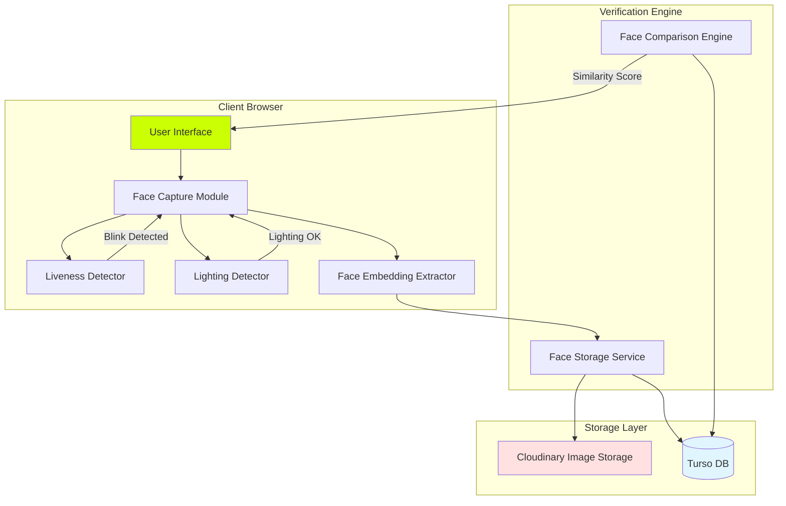
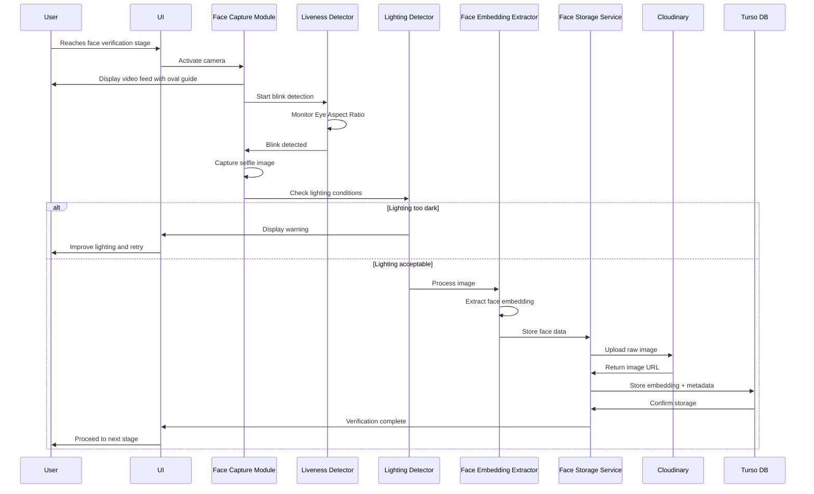
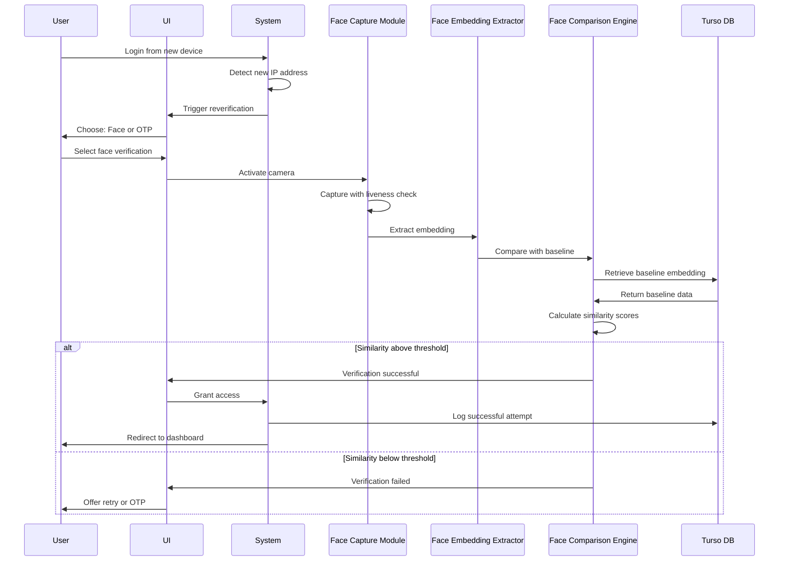

# Design Document: Face Verification and Reverification System

## Overview

The Face Verification and Reverification System provides biometric authentication for ScrowPay users through facial recognition technology. The system captures facial images during account creation, extracts numerical face embeddings, and stores them for future identity verification. When security-sensitive events occur (such as login from a new device), the system reverifies user identity by comparing a newly captured face embedding against the stored baseline.

### Key Capabilities

- **Initial Face Capture**: Captures user selfies during account registration with liveness detection
- **Liveness Detection**: Uses MediaPipe Face Mesh to detect eye blinks, preventing photo-based spoofing
- **Lighting Quality Assessment**: Analyzes image luminance to ensure adequate lighting conditions
- **Face Embedding Extraction**: Converts facial images into numerical vectors for efficient comparison
- **Secure Storage**: Stores raw images in Cloudinary and embeddings in Turso DB with encryption
- **Reverification**: Compares new face captures against baseline data using similarity metrics
- **Fallback Authentication**: Offers OTP verification as an alternative when face verification fails

### Technology Stack

- **Frontend**: HTML5, JavaScript (ES6+), Tailwind CSS
- **Face Detection**: MediaPipe Face Mesh (via CDN)
- **Face Recognition**: face-api.js (TensorFlow.js-based)
- **Image Storage**: Cloudinary API
- **Database**: Turso DB (libSQL with vector support)
- **Camera Access**: WebRTC getUserMedia API

## Architecture

### High-Level System Architecture



### Component Architecture

The system follows a modular architecture with clear separation of concerns:

1. **Presentation Layer**: User interface components for camera preview and user feedback
2. **Capture Layer**: Camera access, image capture, and quality validation
3. **Detection Layer**: Liveness detection (blink) and lighting analysis
4. **Processing Layer**: Face embedding extraction using neural networks
5. **Storage Layer**: Persistent storage for images and embeddings
6. **Comparison Layer**: Similarity calculation and verification logic

### Data Flow

#### Initial Face Capture Flow



#### Reverification Flow



## Components and Interfaces

### 1. Face_Capture_Module

**Responsibility**: Manages camera access, video feed display, and image capture.

**Interface**:
```javascript
class FaceCaptureModule {
  /**
   * Activates device camera and displays video feed
   * @returns {Promise<MediaStream>}
   * @throws {Error} If camera permission denied
   */
  async activateCamera();
  
  /**
   * Captures a still image from the video stream
   * @returns {Promise<Blob>} Captured image as blob
   */
  async captureImage();
  
  /**
   * Stops camera and releases resources
   * @returns {Promise<void>}
   */
  async stopCamera();
  
  /**
   * Displays oval guide overlay on video feed
   * @param {HTMLCanvasElement} canvas
   */
  renderOvalGuide(canvas);
}
```

**Dependencies**:
- WebRTC getUserMedia API
- HTML5 Canvas API
- Liveness_Detector
- Lighting_Detector

**Key Behaviors**:
- Requests camera permissions with user-friendly error messages
- Displays live video feed with 640x480 resolution
- Overlays oval guide to help user position face
- Coordinates with Liveness_Detector to trigger capture on blink
- Releases camera resources when capture completes

### 2. Liveness_Detector

**Responsibility**: Detects eye blinks using MediaPipe Face Mesh to verify physical presence.

**Interface**:
```javascript
class LivenessDetector {
  /**
   * Initializes MediaPipe Face Mesh
   * @returns {Promise<void>}
   */
  async initialize();
  
  /**
   * Starts blink detection on video stream
   * @param {Function} onBlinkDetected - Callback when blink detected
   * @returns {Promise<void>}
   */
  async startDetection(onBlinkDetected);
  
  /**
   * Stops blink detection
   */
  stopDetection();
  
  /**
   * Calculates Eye Aspect Ratio from landmarks
   * @param {Array} landmarks - Facial landmarks
   * @param {Array} eyeIndices - Eye landmark indices
   * @returns {number} EAR value
   */
  calculateEAR(landmarks, eyeIndices);
}
```

**Dependencies**:
- MediaPipe Face Mesh (CDN: @mediapipe/face_mesh)
- MediaPipe Camera Utils (CDN: @mediapipe/camera_utils)

**Key Behaviors**:
- Detects 468 facial landmarks in real-time
- Calculates Eye Aspect Ratio (EAR) for both eyes
- Detects blink when EAR drops below 0.25 then rises above
- Triggers callback immediately upon blink detection
- Implements 30-second timeout if no blink detected

**Algorithm**:
```
EAR = (||p2 - p6|| + ||p3 - p5||) / (2 * ||p1 - p4||)

Where:
- p1, p4: horizontal eye corners (outer and inner)
- p2, p3, p5, p6: vertical eye points (top and bottom)

Blink Detection:
1. Monitor EAR continuously
2. If EAR < 0.25: Mark eye as closing
3. If EAR > 0.25 after closing: Blink detected
```

### 3. Lighting_Detector

**Responsibility**: Analyzes image luminance to detect poor lighting conditions.

**Interface**:
```javascript
class LightingDetector {
  /**
   * Calculates luminance from image data
   * @param {ImageData} imageData - Canvas image data
   * @returns {number} Average luminance (0-255)
   */
  calculateLuminance(imageData);
  
  /**
   * Checks if lighting is adequate
   * @param {number} luminance - Luminance value
   * @returns {boolean} True if lighting is acceptable
   */
  isLightingAdequate(luminance);
  
  /**
   * Analyzes image and returns lighting assessment
   * @param {Blob} imageBlob - Captured image
   * @returns {Promise<Object>} {adequate: boolean, luminance: number}
   */
  async assessLighting(imageBlob);
}
```

**Dependencies**:
- HTML5 Canvas API

**Key Behaviors**:
- Extracts pixel data from captured image
- Calculates luminance using formula: L = 0.299×R + 0.587×G + 0.114×B
- Classifies image as "too dark" if luminance < 50
- Returns assessment with luminance value for logging

**Thresholds**:
- **Too Dark**: Luminance < 50
- **Acceptable**: Luminance ≥ 50
- **Optimal**: Luminance 100-200

### 4. Face_Embedding_Extractor

**Responsibility**: Converts facial images into numerical vector representations using face recognition models.

**Interface**:
```javascript
class FaceEmbeddingExtractor {
  /**
   * Initializes face recognition model
   * @returns {Promise<void>}
   */
  async initialize();
  
  /**
   * Extracts face embedding from image
   * @param {Blob} imageBlob - Face image
   * @returns {Promise<Float32Array>} Face embedding vector (128 or 512 floats)
   * @throws {Error} If no face or multiple faces detected
   */
  async extractEmbedding(imageBlob);
  
  /**
   * Detects number of faces in image
   * @param {Blob} imageBlob
   * @returns {Promise<number>} Number of faces detected
   */
  async detectFaceCount(imageBlob);
}
```

**Dependencies**:
- face-api.js (TensorFlow.js-based face recognition)
- Pre-trained models: ssdMobilenetv1, faceLandmark68Net, faceRecognitionNet

**Key Behaviors**:
- Loads pre-trained neural network models on initialization
- Detects faces using SSD MobileNet v1
- Extracts 68 facial landmarks
- Generates 128-dimensional face descriptor (embedding)
- Returns error if 0 or >1 faces detected
- Normalizes embedding vector for consistent comparison

**Model Loading**:
```javascript
await faceapi.nets.ssdMobilenetv1.loadFromUri('/models');
await faceapi.nets.faceLandmark68Net.loadFromUri('/models');
await faceapi.nets.faceRecognitionNet.loadFromUri('/models');
```

### 5. Face_Storage_Service

**Responsibility**: Stores raw images in Cloudinary and embeddings in Turso DB.

**Interface**:
```javascript
class FaceStorageService {
  /**
   * Stores face data (image + embedding)
   * @param {Object} faceData
   * @param {string} faceData.phoneNumber - User identifier
   * @param {Blob} faceData.imageBlob - Raw face image
   * @param {Float32Array} faceData.embedding - Face embedding vector
   * @returns {Promise<Object>} {imageUrl: string, embeddingId: number}
   */
  async storeFaceData(faceData);
  
  /**
   * Uploads image to Cloudinary
   * @param {Blob} imageBlob
   * @param {string} phoneNumber - For filename
   * @returns {Promise<string>} Cloudinary URL
   */
  async uploadToCloudinary(imageBlob, phoneNumber);
  
  /**
   * Stores embedding in Turso DB
   * @param {Object} embeddingData
   * @returns {Promise<number>} Database record ID
   */
  async storeEmbedding(embeddingData);
  
  /**
   * Retrieves baseline face data for user
   * @param {string} phoneNumber
   * @returns {Promise<Object>} {embedding: Float32Array, imageUrl: string, createdAt: Date}
   */
  async getBaselineFaceData(phoneNumber);
}
```

**Dependencies**:
- Cloudinary Upload API
- Turso DB HTTP API
- TursoDBService

**Key Behaviors**:
- Uploads images to Cloudinary with retry logic (3 attempts)
- Stores embeddings as JSON array in Turso DB
- Associates face data with user phone number
- Encrypts embeddings at rest in database
- Uses HTTPS for all data transmission
- Implements transaction rollback if either storage operation fails

**Cloudinary Configuration**:
```javascript
{
  cloud_name: 'scrowpay',
  upload_preset: 'face_verification',
  folder: 'face_verification',
  resource_type: 'image',
  format: 'jpg',
  transformation: [
    { width: 640, height: 480, crop: 'limit' },
    { quality: 'auto:good' }
  ]
}
```

### 6. Face_Comparison_Engine

**Responsibility**: Compares face embeddings using similarity metrics to verify identity.

**Interface**:
```javascript
class FaceComparisonEngine {
  /**
   * Compares two face embeddings
   * @param {Float32Array} embedding1 - Baseline embedding
   * @param {Float32Array} embedding2 - Reverification embedding
   * @returns {Object} {euclideanDistance: number, cosineSimilarity: number, isMatch: boolean}
   */
  compareEmbeddings(embedding1, embedding2);
  
  /**
   * Calculates Euclidean distance between embeddings
   * @param {Float32Array} emb1
   * @param {Float32Array} emb2
   * @returns {number} Distance value (lower = more similar)
   */
  calculateEuclideanDistance(emb1, emb2);
  
  /**
   * Calculates cosine similarity between embeddings
   * @param {Float32Array} emb1
   * @param {Float32Array} emb2
   * @returns {number} Similarity value (higher = more similar, range: -1 to 1)
   */
  calculateCosineSimilarity(emb1, emb2);
  
  /**
   * Determines if embeddings match based on thresholds
   * @param {number} euclideanDistance
   * @param {number} cosineSimilarity
   * @returns {boolean} True if match
   */
  isMatch(euclideanDistance, cosineSimilarity);
}
```

**Dependencies**: None (pure mathematical operations)

**Key Behaviors**:
- Calculates both Euclidean distance and cosine similarity
- Uses configurable thresholds for match determination
- Returns detailed similarity scores for logging
- Implements efficient vector operations

**Similarity Metrics**:

1. **Euclidean Distance**:
```
distance = sqrt(Σ(emb1[i] - emb2[i])²)

Match if: distance < threshold (default: 0.6)
```

2. **Cosine Similarity**:
```
similarity = (emb1 · emb2) / (||emb1|| × ||emb2||)

Match if: similarity > threshold (default: 0.7)
```

**Match Logic**:
```
isMatch = (euclideanDistance < 0.6) OR (cosineSimilarity > 0.7)
```

## Data Models

### Database Schema

#### face_verification_data Table

Stores baseline face embeddings and metadata for each user.

```sql
CREATE TABLE face_verification_data (
  id INTEGER PRIMARY KEY AUTOINCREMENT,
  phone_number TEXT UNIQUE NOT NULL,
  face_embedding TEXT NOT NULL,  -- JSON array of floats
  cloudinary_url TEXT NOT NULL,
  created_at DATETIME DEFAULT CURRENT_TIMESTAMP,
  updated_at DATETIME DEFAULT CURRENT_TIMESTAMP,
  
  FOREIGN KEY (phone_number) REFERENCES users(phone_number) ON DELETE CASCADE
);

CREATE UNIQUE INDEX idx_fvd_phone ON face_verification_data(phone_number);
CREATE INDEX idx_fvd_created ON face_verification_data(created_at);
```

**Columns**:
- `id`: Auto-incrementing primary key
- `phone_number`: User identifier (format: +234XXXXXXXXXX)
- `face_embedding`: JSON-encoded array of 128 float values
- `cloudinary_url`: URL to raw face image in Cloudinary
- `created_at`: Timestamp of initial face capture
- `updated_at`: Timestamp of last update

**Example Record**:
```json
{
  "id": 1,
  "phone_number": "+2348135866028",
  "face_embedding": "[0.123, -0.456, 0.789, ...]",  // 128 floats
  "cloudinary_url": "https://res.cloudinary.com/scrowpay/image/upload/v1234567890/face_verification/2348135866028_baseline.jpg",
  "created_at": "2024-01-15T10:30:00Z",
  "updated_at": "2024-01-15T10:30:00Z"
}
```

#### reverification_logs Table

Logs all reverification attempts for audit and fraud detection.

```sql
CREATE TABLE reverification_logs (
  id INTEGER PRIMARY KEY AUTOINCREMENT,
  phone_number TEXT NOT NULL,
  attempt_timestamp DATETIME DEFAULT CURRENT_TIMESTAMP,
  result TEXT NOT NULL CHECK(result IN ('success', 'failure')),
  similarity_score_euclidean REAL,
  similarity_score_cosine REAL,
  ip_address TEXT NOT NULL,
  user_agent TEXT,
  failure_reason TEXT,
  
  FOREIGN KEY (phone_number) REFERENCES users(phone_number) ON DELETE CASCADE
);

CREATE INDEX idx_rvl_phone ON reverification_logs(phone_number);
CREATE INDEX idx_rvl_timestamp ON reverification_logs(attempt_timestamp);
CREATE INDEX idx_rvl_result ON reverification_logs(result);
CREATE INDEX idx_rvl_ip ON reverification_logs(ip_address);
```

**Columns**:
- `id`: Auto-incrementing primary key
- `phone_number`: User identifier
- `attempt_timestamp`: When reverification was attempted
- `result`: 'success' or 'failure'
- `similarity_score_euclidean`: Euclidean distance (lower = more similar)
- `similarity_score_cosine`: Cosine similarity (higher = more similar)
- `ip_address`: IP address of reverification attempt
- `user_agent`: Browser user agent string
- `failure_reason`: Reason for failure (if applicable)

**Example Record**:
```json
{
  "id": 42,
  "phone_number": "+2348135866028",
  "attempt_timestamp": "2024-01-20T14:25:00Z",
  "result": "success",
  "similarity_score_euclidean": 0.42,
  "similarity_score_cosine": 0.85,
  "ip_address": "197.210.55.123",
  "user_agent": "Mozilla/5.0 (Windows NT 10.0; Win64; x64)...",
  "failure_reason": null
}
```

#### verification_config Table

Stores configurable thresholds and system parameters.

```sql
CREATE TABLE verification_config (
  id INTEGER PRIMARY KEY AUTOINCREMENT,
  config_key TEXT UNIQUE NOT NULL,
  config_value TEXT NOT NULL,
  description TEXT,
  updated_at DATETIME DEFAULT CURRENT_TIMESTAMP
);

-- Default configuration
INSERT INTO verification_config (config_key, config_value, description) VALUES
  ('euclidean_threshold', '0.6', 'Maximum Euclidean distance for match'),
  ('cosine_threshold', '0.7', 'Minimum cosine similarity for match'),
  ('luminance_threshold', '50', 'Minimum luminance for acceptable lighting'),
  ('blink_ear_threshold', '0.25', 'Eye Aspect Ratio threshold for blink detection'),
  ('blink_timeout_seconds', '30', 'Timeout for blink detection'),
  ('reverification_timeout_minutes', '5', 'Timeout for reverification process'),
  ('max_retry_attempts', '3', 'Maximum failed attempts before fallback to OTP');
```

### Cloudinary Storage Structure

**Folder Structure**:
```
/face_verification/
  ├── baselines/
  │   ├── 2348135866028_baseline.jpg
  │   ├── 2349012345678_baseline.jpg
  │   └── ...
  └── reverifications/
      ├── 2348135866028_20240120_142500.jpg
      ├── 2348135866028_20240121_093000.jpg
      └── ...
```

**Image Metadata**:
- **Format**: JPEG
- **Resolution**: 640x480 (max)
- **Quality**: Auto (Cloudinary optimization)
- **Transformations**: Applied on upload
- **Tags**: `baseline` or `reverification`, `phone_number`

**URL Format**:
```
https://res.cloudinary.com/{cloud_name}/image/upload/v{version}/{folder}/{filename}
```

### In-Memory Data Structures

#### FaceData Object

```javascript
{
  phoneNumber: string,        // "+234XXXXXXXXXX"
  imageBlob: Blob,            // Raw image data
  embedding: Float32Array,    // 128-dimensional vector
  luminance: number,          // 0-255
  captureTimestamp: Date,
  blinkDetected: boolean
}
```

#### ComparisonResult Object

```javascript
{
  isMatch: boolean,
  euclideanDistance: number,
  cosineSimilarity: number,
  confidence: number,         // 0-100
  timestamp: Date
}
```

#### ReverificationRequest Object

```javascript
{
  phoneNumber: string,
  ipAddress: string,
  userAgent: string,
  triggerReason: string,      // "new_device", "suspicious_activity", etc.
  timestamp: Date
}
```


## API Contracts and Interfaces

### Cloudinary Upload API

**Endpoint**: `https://api.cloudinary.com/v1_1/{cloud_name}/image/upload`

**Method**: POST (multipart/form-data)

**Request**:
```javascript
{
  file: Blob,                    // Image file
  upload_preset: string,         // "face_verification"
  folder: string,                // "face_verification/baselines" or "face_verification/reverifications"
  public_id: string,             // "{phone_number}_{type}_{timestamp}"
  tags: string[],                // ["baseline"] or ["reverification"]
  context: {
    phone_number: string,
    capture_type: string,        // "baseline" or "reverification"
    timestamp: string
  }
}
```

**Response (Success - 200)**:
```javascript
{
  public_id: string,
  version: number,
  signature: string,
  width: number,
  height: number,
  format: string,
  resource_type: string,
  created_at: string,
  bytes: number,
  url: string,                   // HTTP URL
  secure_url: string,            // HTTPS URL
  etag: string
}
```

**Response (Error - 400/500)**:
```javascript
{
  error: {
    message: string,
    http_code: number
  }
}
```

**Retry Logic**:
- Retry on 5xx errors (up to 3 attempts)
- Exponential backoff: 1s, 2s, 4s
- Fail permanently on 4xx errors

### Turso DB HTTP API

**Endpoint**: `https://{database_name}.turso.io/v2/pipeline`

**Method**: POST

**Headers**:
```
Authorization: Bearer {auth_token}
Content-Type: application/json
```

#### Store Face Embedding

**Request**:
```javascript
{
  requests: [
    {
      type: "execute",
      stmt: {
        sql: "INSERT INTO face_verification_data (phone_number, face_embedding, cloudinary_url) VALUES (?, ?, ?)",
        args: [
          { type: "text", value: "+2348135866028" },
          { type: "text", value: "[0.123, -0.456, ...]" },
          { type: "text", value: "https://..." }
        ]
      }
    },
    { type: "close" }
  ]
}
```

**Response (Success)**:
```javascript
{
  results: [
    {
      type: "ok",
      response: {
        type: "execute",
        result: {
          cols: [],
          rows: [],
          affected_row_count: 1,
          last_insert_rowid: 42
        }
      }
    },
    {
      type: "ok",
      response: { type: "close" }
    }
  ]
}
```

#### Retrieve Baseline Embedding

**Request**:
```javascript
{
  requests: [
    {
      type: "execute",
      stmt: {
        sql: "SELECT face_embedding, cloudinary_url, created_at FROM face_verification_data WHERE phone_number = ?",
        args: [
          { type: "text", value: "+2348135866028" }
        ]
      }
    },
    { type: "close" }
  ]
}
```

**Response (Success)**:
```javascript
{
  results: [
    {
      type: "ok",
      response: {
        type: "execute",
        result: {
          cols: [
            { name: "face_embedding" },
            { name: "cloudinary_url" },
            { name: "created_at" }
          ],
          rows: [
            [
              { type: "text", value: "[0.123, -0.456, ...]" },
              { type: "text", value: "https://..." },
              { type: "text", value: "2024-01-15T10:30:00Z" }
            ]
          ]
        }
      }
    },
    {
      type: "ok",
      response: { type: "close" }
    }
  ]
}
```

#### Log Reverification Attempt

**Request**:
```javascript
{
  requests: [
    {
      type: "execute",
      stmt: {
        sql: "INSERT INTO reverification_logs (phone_number, result, similarity_score_euclidean, similarity_score_cosine, ip_address, user_agent) VALUES (?, ?, ?, ?, ?, ?)",
        args: [
          { type: "text", value: "+2348135866028" },
          { type: "text", value: "success" },
          { type: "float", value: 0.42 },
          { type: "float", value: 0.85 },
          { type: "text", value: "197.210.55.123" },
          { type: "text", value: "Mozilla/5.0..." }
        ]
      }
    },
    { type: "close" }
  ]
}
```

### Internal Service Interfaces

#### FaceCaptureModule → LivenessDetector

```javascript
// Start blink detection
livenessDetector.startDetection((blinkEvent) => {
  // Callback when blink detected
  faceCaptureModule.captureImage();
});
```

#### FaceCaptureModule → LightingDetector

```javascript
// Check lighting after capture
const assessment = await lightingDetector.assessLighting(imageBlob);
if (!assessment.adequate) {
  showWarning("Lighting too dark. Please improve lighting and retry.");
  return;
}
```

#### FaceEmbeddingExtractor → FaceStorageService

```javascript
// Extract and store
const embedding = await faceEmbeddingExtractor.extractEmbedding(imageBlob);
const result = await faceStorageService.storeFaceData({
  phoneNumber: "+2348135866028",
  imageBlob: imageBlob,
  embedding: embedding
});
```

#### FaceComparisonEngine Usage

```javascript
// Retrieve baseline
const baseline = await faceStorageService.getBaselineFaceData(phoneNumber);

// Extract new embedding
const newEmbedding = await faceEmbeddingExtractor.extractEmbedding(newImageBlob);

// Compare
const comparison = faceComparisonEngine.compareEmbeddings(
  baseline.embedding,
  newEmbedding
);

if (comparison.isMatch) {
  // Grant access
  await logReverificationAttempt(phoneNumber, "success", comparison);
} else {
  // Deny access
  await logReverificationAttempt(phoneNumber, "failure", comparison);
}
```

## Security Architecture

### Data Encryption

#### At Rest

**Turso DB Encryption**:
- Face embeddings stored as encrypted TEXT columns
- Turso provides transparent encryption at rest
- AES-256 encryption for all data
- Encryption keys managed by Turso infrastructure

**Cloudinary Encryption**:
- Images stored with server-side encryption
- HTTPS-only access enforced
- Signed URLs for temporary access (optional)

#### In Transit

**All Network Communication**:
- HTTPS/TLS 1.3 for all API calls
- Certificate pinning for Cloudinary and Turso endpoints
- No face data transmitted over unencrypted connections

**Browser to Server**:
```javascript
// Enforce HTTPS
if (window.location.protocol !== 'https:') {
  throw new Error('Face verification requires HTTPS');
}
```

### Access Control

#### Camera Permissions

**Permission Request Flow**:
1. Request camera access with clear explanation
2. Handle permission denial gracefully
3. Provide instructions to enable permissions
4. Offer OTP fallback if camera unavailable

**Permission Check**:
```javascript
async function requestCameraPermission() {
  try {
    const stream = await navigator.mediaDevices.getUserMedia({ 
      video: { 
        width: 640, 
        height: 480,
        facingMode: 'user'
      } 
    });
    return stream;
  } catch (error) {
    if (error.name === 'NotAllowedError') {
      throw new Error('Camera permission denied. Please enable camera access in browser settings.');
    }
    throw error;
  }
}
```

#### Database Access Control

**Row-Level Security**:
- Users can only access their own face data
- Phone number used as access control key
- No cross-user data access permitted

**Query Validation**:
```javascript
// Always include phone number filter
const query = `
  SELECT face_embedding 
  FROM face_verification_data 
  WHERE phone_number = ?
`;
// Prevents unauthorized access to other users' data
```

### Data Privacy

#### GDPR Compliance

**User Rights**:
- **Right to Access**: Users can view their stored face data
- **Right to Deletion**: Users can delete face data on account closure
- **Right to Portability**: Users can export face data (embedding + image URL)

**Data Retention**:
- Baseline face data: Retained while account is active
- Reverification logs: Retained for 90 days
- Deleted face data: Permanently removed from Cloudinary and Turso DB

**Deletion Implementation**:
```javascript
async function deleteFaceData(phoneNumber) {
  // 1. Delete from Turso DB
  await tursoDBService.execute(
    'DELETE FROM face_verification_data WHERE phone_number = ?',
    [phoneNumber]
  );
  
  // 2. Delete from Cloudinary
  const publicId = `face_verification/baselines/${phoneNumber}_baseline`;
  await cloudinary.uploader.destroy(publicId);
  
  // 3. Delete reverification logs (optional, based on retention policy)
  await tursoDBService.execute(
    'DELETE FROM reverification_logs WHERE phone_number = ? AND attempt_timestamp < datetime("now", "-90 days")',
    [phoneNumber]
  );
}
```

#### Biometric Data Protection

**Minimal Data Storage**:
- Store embeddings (numerical vectors) instead of raw images when possible
- Raw images stored only for audit purposes
- Embeddings are one-way transformations (cannot reconstruct face from embedding)

**No Third-Party Sharing**:
- Face data never shared with third parties
- No analytics or tracking on face data
- Cloudinary configured for private storage only

### Threat Mitigation

#### Spoofing Prevention

**Liveness Detection**:
- Blink detection prevents photo-based attacks
- Real-time video feed required (no pre-recorded videos)
- Random blink timing makes replay attacks difficult

**Future Enhancements**:
- Challenge-response (e.g., "turn head left")
- Depth sensing (if device supports)
- Texture analysis to detect printed photos

#### Replay Attack Prevention

**Timestamp Validation**:
- Each capture includes timestamp
- Reverification requests expire after 5 minutes
- Old embeddings cannot be reused

**Session Binding**:
- Reverification tied to specific session
- IP address and user agent logged
- Suspicious patterns flagged for review

#### Man-in-the-Middle Prevention

**Certificate Pinning**:
```javascript
// Verify Cloudinary certificate
const expectedFingerprint = 'SHA256:...';
// Implemented at network layer
```

**Integrity Checks**:
- Embeddings include checksum
- Detect tampering during transmission
- Reject modified embeddings

### Audit Logging

**Logged Events**:
- Face capture attempts (success/failure)
- Reverification attempts (success/failure)
- Similarity scores for all comparisons
- IP addresses and user agents
- Lighting conditions and blink detection results

**Log Retention**:
- Security logs: 1 year
- Reverification logs: 90 days
- Access logs: 30 days

**Log Analysis**:
- Detect unusual patterns (e.g., multiple failed attempts)
- Flag suspicious IP addresses
- Monitor for potential fraud

## Error Handling

### Error Categories

#### 1. Camera Access Errors

**Error**: Camera permission denied
```javascript
{
  code: 'CAMERA_PERMISSION_DENIED',
  message: 'Camera access is required for face verification. Please enable camera permissions in your browser settings.',
  userAction: 'Enable camera permissions or use OTP verification',
  recoverable: true
}
```

**Error**: Camera not available
```javascript
{
  code: 'CAMERA_NOT_AVAILABLE',
  message: 'No camera detected on this device.',
  userAction: 'Use a device with a camera or choose OTP verification',
  recoverable: true
}
```

**Error**: Camera in use by another application
```javascript
{
  code: 'CAMERA_IN_USE',
  message: 'Camera is currently in use by another application.',
  userAction: 'Close other applications using the camera and retry',
  recoverable: true
}
```

#### 2. Face Detection Errors

**Error**: No face detected
```javascript
{
  code: 'NO_FACE_DETECTED',
  message: 'No face detected in the image. Please ensure your face is visible and well-lit.',
  userAction: 'Retry capture with face clearly visible',
  recoverable: true
}
```

**Error**: Multiple faces detected
```javascript
{
  code: 'MULTIPLE_FACES_DETECTED',
  message: 'Multiple faces detected. Please ensure only your face is visible in the frame.',
  userAction: 'Retry capture with only one face visible',
  recoverable: true
}
```

**Error**: Face too far
```javascript
{
  code: 'FACE_TOO_FAR',
  message: 'Face is too far from the camera. Please move closer.',
  userAction: 'Move closer to the camera and retry',
  recoverable: true
}
```

**Error**: Face too close
```javascript
{
  code: 'FACE_TOO_CLOSE',
  message: 'Face is too close to the camera. Please move back.',
  userAction: 'Move back from the camera and retry',
  recoverable: true
}
```

#### 3. Lighting Errors

**Error**: Lighting too dark
```javascript
{
  code: 'LIGHTING_TOO_DARK',
  message: 'Lighting conditions are too dark. Please improve lighting and retry.',
  userAction: 'Move to a well-lit area or turn on lights',
  recoverable: true,
  metadata: {
    luminance: 35,
    threshold: 50
  }
}
```

#### 4. Liveness Detection Errors

**Error**: No blink detected (timeout)
```javascript
{
  code: 'BLINK_TIMEOUT',
  message: 'No blink detected within 30 seconds. Please blink naturally and retry.',
  userAction: 'Retry and blink naturally when prompted',
  recoverable: true
}
```

**Error**: MediaPipe initialization failed
```javascript
{
  code: 'MEDIAPIPE_INIT_FAILED',
  message: 'Failed to initialize face detection library. Please refresh the page.',
  userAction: 'Refresh page or try a different browser',
  recoverable: true
}
```

#### 5. Storage Errors

**Error**: Cloudinary upload failed
```javascript
{
  code: 'CLOUDINARY_UPLOAD_FAILED',
  message: 'Failed to upload face image. Please check your internet connection and retry.',
  userAction: 'Check internet connection and retry',
  recoverable: true,
  metadata: {
    attemptCount: 3,
    lastError: 'Network timeout'
  }
}
```

**Error**: Database storage failed
```javascript
{
  code: 'DATABASE_STORAGE_FAILED',
  message: 'Failed to save face data. Please try again.',
  userAction: 'Retry face verification',
  recoverable: true
}
```

#### 6. Verification Errors

**Error**: Baseline not found
```javascript
{
  code: 'BASELINE_NOT_FOUND',
  message: 'No baseline face data found for this account. Please complete initial face verification.',
  userAction: 'Complete account setup with face verification',
  recoverable: false
}
```

**Error**: Verification failed (similarity too low)
```javascript
{
  code: 'VERIFICATION_FAILED',
  message: 'Face verification failed. The captured face does not match your registered face.',
  userAction: 'Retry face verification or use OTP',
  recoverable: true,
  metadata: {
    euclideanDistance: 0.85,
    cosineSimilarity: 0.45,
    threshold: 0.6
  }
}
```

**Error**: Verification timeout
```javascript
{
  code: 'VERIFICATION_TIMEOUT',
  message: 'Face verification timed out. Please try again.',
  userAction: 'Retry face verification',
  recoverable: true
}
```

### Error Handling Strategy

#### User-Facing Errors

**Display Strategy**:
- Show clear, actionable error messages
- Provide specific guidance on how to fix the issue
- Offer alternative authentication methods (OTP)
- Use friendly, non-technical language

**Example Error Display**:
```javascript
function displayError(error) {
  const modal = {
    title: getErrorTitle(error.code),
    message: error.message,
    actions: [
      { text: 'Retry', primary: true, onClick: () => retryCapture() },
      { text: 'Use OTP Instead', onClick: () => switchToOTP() }
    ]
  };
  showModal(modal);
}
```

#### System Errors

**Logging Strategy**:
- Log all errors with full context
- Include stack traces for debugging
- Track error frequency and patterns
- Alert on critical errors

**Error Log Format**:
```javascript
{
  timestamp: '2024-01-20T14:25:00Z',
  errorCode: 'CLOUDINARY_UPLOAD_FAILED',
  errorMessage: 'Network timeout',
  userId: '+2348135866028',
  context: {
    attemptCount: 3,
    imageSize: 245678,
    networkLatency: 5000
  },
  stackTrace: '...'
}
```

#### Retry Logic

**Automatic Retries**:
- Network errors: 3 retries with exponential backoff
- Transient errors: 2 retries with 1-second delay
- User errors: No automatic retry (user must initiate)

**Retry Implementation**:
```javascript
async function uploadWithRetry(imageBlob, maxRetries = 3) {
  for (let attempt = 1; attempt <= maxRetries; attempt++) {
    try {
      return await cloudinary.upload(imageBlob);
    } catch (error) {
      if (attempt === maxRetries) throw error;
      if (!isRetryableError(error)) throw error;
      
      const delay = Math.pow(2, attempt) * 1000; // Exponential backoff
      await sleep(delay);
    }
  }
}
```

#### Fallback Mechanisms

**Face Verification Unavailable**:
1. Offer OTP verification as alternative
2. Allow user to skip face verification (with limitations)
3. Notify user to complete face verification later

**Partial Failure Handling**:
- If Cloudinary upload succeeds but DB storage fails: Rollback Cloudinary upload
- If DB storage succeeds but Cloudinary upload fails: Delete DB record
- Ensure atomic operations (both succeed or both fail)

## Testing Strategy

### Unit Testing

**Components to Test**:
1. **LightingDetector**
   - Test luminance calculation with known pixel values
   - Test threshold classification (too dark vs. acceptable)
   - Test edge cases (all black, all white, grayscale)

2. **FaceComparisonEngine**
   - Test Euclidean distance calculation
   - Test cosine similarity calculation
   - Test match determination logic
   - Test with identical embeddings (should match)
   - Test with random embeddings (should not match)

3. **FaceEmbeddingExtractor**
   - Test with valid face images (should extract embedding)
   - Test with no face (should throw error)
   - Test with multiple faces (should throw error)
   - Test embedding dimensions (should be 128 floats)

4. **FaceStorageService**
   - Test Cloudinary upload (mock API)
   - Test database storage (mock DB)
   - Test transaction rollback on partial failure
   - Test retry logic

**Example Unit Test**:
```javascript
describe('FaceComparisonEngine', () => {
  test('identical embeddings should match', () => {
    const embedding = new Float32Array(128).fill(0.5);
    const result = faceComparisonEngine.compareEmbeddings(embedding, embedding);
    
    expect(result.euclideanDistance).toBe(0);
    expect(result.cosineSimilarity).toBe(1);
    expect(result.isMatch).toBe(true);
  });
  
  test('random embeddings should not match', () => {
    const emb1 = new Float32Array(128).map(() => Math.random());
    const emb2 = new Float32Array(128).map(() => Math.random());
    const result = faceComparisonEngine.compareEmbeddings(emb1, emb2);
    
    expect(result.isMatch).toBe(false);
  });
});
```

### Integration Testing

**Test Scenarios**:

1. **End-to-End Face Capture**
   - Activate camera → Detect blink → Capture image → Check lighting → Extract embedding → Store data
   - Verify all components work together
   - Verify data persisted correctly

2. **End-to-End Reverification**
   - Trigger reverification → Capture new face → Extract embedding → Compare with baseline → Log result
   - Verify successful match grants access
   - Verify failed match denies access

3. **Cloudinary Integration**
   - Upload real image to Cloudinary
   - Verify image accessible via returned URL
   - Verify image metadata correct

4. **Turso DB Integration**
   - Store face embedding in database
   - Retrieve embedding by phone number
   - Verify embedding data integrity

**Example Integration Test**:
```javascript
describe('Face Verification Flow', () => {
  test('complete face capture and storage', async () => {
    // 1. Capture image (mock camera)
    const imageBlob = await mockCameraCapture();
    
    // 2. Check lighting
    const lighting = await lightingDetector.assessLighting(imageBlob);
    expect(lighting.adequate).toBe(true);
    
    // 3. Extract embedding
    const embedding = await faceEmbeddingExtractor.extractEmbedding(imageBlob);
    expect(embedding.length).toBe(128);
    
    // 4. Store data
    const result = await faceStorageService.storeFaceData({
      phoneNumber: '+2348135866028',
      imageBlob,
      embedding
    });
    
    expect(result.imageUrl).toContain('cloudinary.com');
    expect(result.embeddingId).toBeGreaterThan(0);
  });
});
```

### Manual Testing

**Test Cases**:

1. **Camera Permission Scenarios**
   - Grant permission → Should activate camera
   - Deny permission → Should show error and offer OTP
   - Revoke permission mid-capture → Should handle gracefully

2. **Lighting Conditions**
   - Bright lighting → Should pass
   - Dim lighting → Should warn user
   - Very dark → Should reject and prompt retry

3. **Face Positioning**
   - Face centered in oval → Should capture successfully
   - Face partially visible → Should detect but may fail embedding extraction
   - No face visible → Should show "no face detected" error
   - Multiple faces → Should show "multiple faces detected" error

4. **Blink Detection**
   - Natural blink → Should trigger capture
   - No blink for 30 seconds → Should timeout
   - Rapid blinking → Should capture on first blink

5. **Reverification Scenarios**
   - Same person → Should match and grant access
   - Different person → Should not match and deny access
   - Poor lighting during reverification → Should warn and allow retry

**Manual Test Checklist**:
```
[ ] Camera activates on face verification stage
[ ] Oval guide displays correctly
[ ] Blink detection triggers capture
[ ] Lighting warning appears in dark conditions
[ ] Face embedding extracted successfully
[ ] Data stored in Cloudinary and Turso DB
[ ] Reverification compares correctly
[ ] Failed verification offers retry and OTP
[ ] Successful verification grants access
[ ] Error messages are clear and actionable
```

### Performance Testing

**Metrics to Measure**:

1. **Camera Activation Time**
   - Target: < 2 seconds
   - Measure: Time from button click to video feed display

2. **Blink Detection Latency**
   - Target: < 500ms from blink to capture
   - Measure: Time from EAR threshold cross to image capture

3. **Embedding Extraction Time**
   - Target: < 3 seconds
   - Measure: Time from image capture to embedding ready

4. **Storage Time**
   - Target: < 5 seconds total
   - Measure: Time to upload to Cloudinary + store in DB

5. **Reverification Time**
   - Target: < 10 seconds end-to-end
   - Measure: Time from capture to access granted/denied

**Performance Test Script**:
```javascript
async function measurePerformance() {
  const metrics = {};
  
  // 1. Camera activation
  const t1 = performance.now();
  await faceCaptureModule.activateCamera();
  metrics.cameraActivation = performance.now() - t1;
  
  // 2. Blink detection
  const t2 = performance.now();
  await waitForBlink();
  metrics.blinkDetection = performance.now() - t2;
  
  // 3. Embedding extraction
  const t3 = performance.now();
  const embedding = await faceEmbeddingExtractor.extractEmbedding(imageBlob);
  metrics.embeddingExtraction = performance.now() - t3;
  
  // 4. Storage
  const t4 = performance.now();
  await faceStorageService.storeFaceData({...});
  metrics.storage = performance.now() - t4;
  
  console.log('Performance Metrics:', metrics);
}
```

### Security Testing

**Test Scenarios**:

1. **Spoofing Attempts**
   - Hold photo in front of camera → Should fail (no blink detected)
   - Play video of person → Should fail (blink timing unnatural)
   - Use 3D mask → Should fail (texture analysis, future enhancement)

2. **Replay Attacks**
   - Reuse old embedding → Should fail (timestamp validation)
   - Intercept and replay network request → Should fail (session binding)

3. **Data Tampering**
   - Modify embedding in transit → Should fail (integrity check)
   - Modify similarity threshold → Should be prevented (server-side config)

4. **Unauthorized Access**
   - Access another user's face data → Should fail (row-level security)
   - Query without phone number filter → Should fail (query validation)

**Security Test Checklist**:
```
[ ] Photo-based spoofing prevented by blink detection
[ ] Replay attacks prevented by timestamp validation
[ ] Data tampering detected by integrity checks
[ ] Unauthorized access prevented by access control
[ ] HTTPS enforced for all communication
[ ] Camera permissions handled securely
[ ] Face data deleted on account closure
```

## Implementation Notes

### Browser Compatibility

**Supported Browsers**:
- Chrome 90+ (recommended)
- Firefox 88+
- Safari 14+
- Edge 90+

**Required Features**:
- WebRTC getUserMedia API
- HTML5 Canvas API
- ES6+ JavaScript support
- TensorFlow.js support (for face-api.js)

**Polyfills**:
- None required for modern browsers
- Graceful degradation for unsupported browsers (offer OTP only)

### Model Files

**face-api.js Models**:
- `ssd_mobilenetv1_model-weights_manifest.json` (5.4 MB)
- `face_landmark_68_model-weights_manifest.json` (350 KB)
- `face_recognition_model-weights_manifest.json` (6.2 MB)

**Hosting**:
- Host models on same domain as application
- Use CDN for faster loading
- Cache models in browser (IndexedDB)

**Loading Strategy**:
```javascript
// Load models on app initialization (not on every page load)
const MODEL_URL = '/models';

async function loadModels() {
  await faceapi.nets.ssdMobilenetv1.loadFromUri(MODEL_URL);
  await faceapi.nets.faceLandmark68Net.loadFromUri(MODEL_URL);
  await faceapi.nets.faceRecognitionNet.loadFromUri(MODEL_URL);
  console.log('Face recognition models loaded');
}

// Call once on app start
loadModels();
```

### Performance Optimization

**Lazy Loading**:
- Load face recognition models only when needed
- Defer MediaPipe initialization until face verification stage

**Caching**:
- Cache models in browser storage
- Cache Cloudinary URLs for faster image retrieval

**Image Optimization**:
- Compress images before upload (JPEG quality 85)
- Resize to 640x480 before processing
- Use WebP format if supported

**Embedding Storage**:
- Store embeddings as JSON arrays (not binary)
- Compress embeddings if size is concern (future enhancement)

### Monitoring and Observability

**Metrics to Track**:
- Face verification success rate
- Average verification time
- Blink detection success rate
- Lighting rejection rate
- Cloudinary upload success rate
- Database storage success rate

**Alerts**:
- Alert if success rate drops below 90%
- Alert if average verification time exceeds 15 seconds
- Alert if storage failures exceed 5% of attempts

**Dashboard**:
- Real-time verification attempts
- Success/failure breakdown
- Average similarity scores
- Geographic distribution of attempts

## Future Enhancements

### Phase 2 Features

1. **Advanced Liveness Detection**
   - Challenge-response (e.g., "turn head left/right")
   - Smile detection
   - Depth sensing (for devices with depth cameras)

2. **Multi-Factor Biometrics**
   - Combine face + voice recognition
   - Combine face + fingerprint (for mobile devices)

3. **Adaptive Thresholds**
   - Machine learning to adjust thresholds based on user patterns
   - Personalized similarity thresholds per user

4. **Fraud Detection**
   - Anomaly detection for suspicious patterns
   - Behavioral biometrics (typing patterns, mouse movements)

5. **Offline Support**
   - Store embeddings locally for offline verification
   - Sync when connection restored

### Technical Debt

1. **Model Optimization**
   - Use quantized models for faster inference
   - Explore WebAssembly for better performance

2. **Storage Optimization**
   - Compress embeddings using dimensionality reduction
   - Use binary format instead of JSON for embeddings

3. **Testing**
   - Add property-based tests for similarity calculations
   - Add visual regression tests for UI components

4. **Documentation**
   - Add API documentation with examples
   - Create user guide for face verification

---

**Document Version**: 1.0  
**Last Updated**: 2024-01-20  
**Authors**: ScrowPay Engineering Team  
**Status**: Ready for Implementation

## Correctness Properties

*A property is a characteristic or behavior that should hold true across all valid executions of a system—essentially, a formal statement about what the system should do. Properties serve as the bridge between human-readable specifications and machine-verifiable correctness guarantees.*

The face verification system includes several pure mathematical functions and logic components that are well-suited for property-based testing. These properties focus on the core algorithms for lighting detection, liveness detection, similarity calculation, and verification logic.

### Property 1: Luminance Calculation Correctness

*For any* RGB pixel values (R, G, B) where each value is in the range [0, 255], the calculated luminance SHALL equal 0.299×R + 0.587×G + 0.114×B.

**Validates: Requirements 2.1**

**Rationale**: The luminance formula is a standard weighted sum that must be applied consistently to all pixels. Property-based testing ensures the formula is implemented correctly across the entire input space.

### Property 2: Luminance Classification Threshold

*For any* luminance value L in the range [0, 255], the lighting classification SHALL be "too dark" if and only if L < 50, and "acceptable" if and only if L ≥ 50.

**Validates: Requirements 2.2**

**Rationale**: The threshold-based classification must be consistent for all luminance values. This property verifies the boundary condition at luminance = 50.

### Property 3: Eye Aspect Ratio Calculation

*For any* set of 6 eye landmark points (p1, p2, p3, p4, p5, p6) with valid 3D coordinates, the calculated Eye Aspect Ratio SHALL equal (||p2 - p6|| + ||p3 - p5||) / (2 × ||p1 - p4||).

**Validates: Requirements 3.2**

**Rationale**: The EAR formula is a geometric calculation that must be applied consistently to all eye landmark configurations. Property-based testing ensures numerical stability and correctness.

### Property 4: Eye State Classification

*For any* Eye Aspect Ratio value EAR, the eye state SHALL be classified as "closing" if and only if EAR < 0.25, and "open" if and only if EAR ≥ 0.25.

**Validates: Requirements 3.3**

**Rationale**: The threshold-based state classification must be consistent for all EAR values. This property verifies the boundary condition at EAR = 0.25.

### Property 5: Blink Detection State Machine

*For any* sequence of Eye Aspect Ratio values, a blink SHALL be detected if and only if there exists a transition from EAR < 0.25 to EAR ≥ 0.25.

**Validates: Requirements 3.4**

**Rationale**: Blink detection is a state machine that must correctly identify the closing-to-opening transition regardless of the specific EAR values or sequence length.

### Property 6: Euclidean Distance Calculation

*For any* two face embedding vectors emb1 and emb2 of equal length n, the Euclidean distance SHALL equal sqrt(Σ(emb1[i] - emb2[i])²) for i from 0 to n-1.

**Validates: Requirements 10.2**

**Rationale**: Euclidean distance is a fundamental metric that must be calculated correctly for all embedding pairs. Property-based testing ensures numerical accuracy and handles edge cases like identical embeddings (distance = 0).

### Property 7: Cosine Similarity Calculation

*For any* two face embedding vectors emb1 and emb2 of equal length n, the cosine similarity SHALL equal (emb1 · emb2) / (||emb1|| × ||emb2||), and the result SHALL be in the range [-1, 1].

**Validates: Requirements 10.3**

**Rationale**: Cosine similarity is a normalized metric that must produce values in the valid range for all embedding pairs. Property-based testing ensures correct normalization and handles edge cases like zero vectors.

### Property 8: Verification Classification Logic

*For any* Euclidean distance D and cosine similarity S, the verification SHALL be classified as "successful" if and only if (D < euclidean_threshold) OR (S > cosine_threshold), and "failed" otherwise.

**Validates: Requirements 10.4, 10.5**

**Rationale**: The verification decision logic must be consistent for all similarity score combinations. This property verifies the OR logic and threshold comparisons.

### Property 9: Upload Retry Logic

*For any* upload operation that fails, the system SHALL retry the operation up to 3 times, resulting in a maximum of 4 total attempts (1 initial + 3 retries).

**Validates: Requirements 5.4**

**Rationale**: Retry logic must be consistent regardless of the failure reason. Property-based testing ensures the retry count is correct for all failure scenarios.

### Property 10: IP Address Matching Logic

*For any* IP address and any list of previously recorded IP addresses, the IP SHALL be classified as "new device" if and only if it does not appear in the list.

**Validates: Requirements 7.2, 7.3**

**Rationale**: IP matching is a simple membership test that must work correctly for all IP addresses and list sizes. Property-based testing ensures correct classification for edge cases like empty lists.

### Property 11: Failure Counter Logic

*For any* sequence of verification attempts, the system SHALL automatically redirect to OTP verification if and only if there are 3 consecutive failures.

**Validates: Requirements 12.5**

**Rationale**: The failure counter must correctly track consecutive failures and trigger the redirect at exactly 3 failures, regardless of the specific failure reasons or timing.

### Property 12: Custom Threshold Application

*For any* custom threshold value T, when configured, all subsequent verification attempts SHALL use T instead of the default threshold value.

**Validates: Requirements 14.3, 14.4**

**Rationale**: Threshold configuration must affect all subsequent operations consistently. Property-based testing ensures the custom value is applied correctly regardless of the threshold value or number of subsequent operations.

---

**Note on Testing Approach**: The face verification system combines pure mathematical functions (suitable for PBT) with external integrations (Cloudinary, Turso DB, MediaPipe, face-api.js) and UI components (not suitable for PBT). The correctness properties above focus on the testable pure functions, while integration tests and example-based tests will cover the external dependencies and UI workflows.

